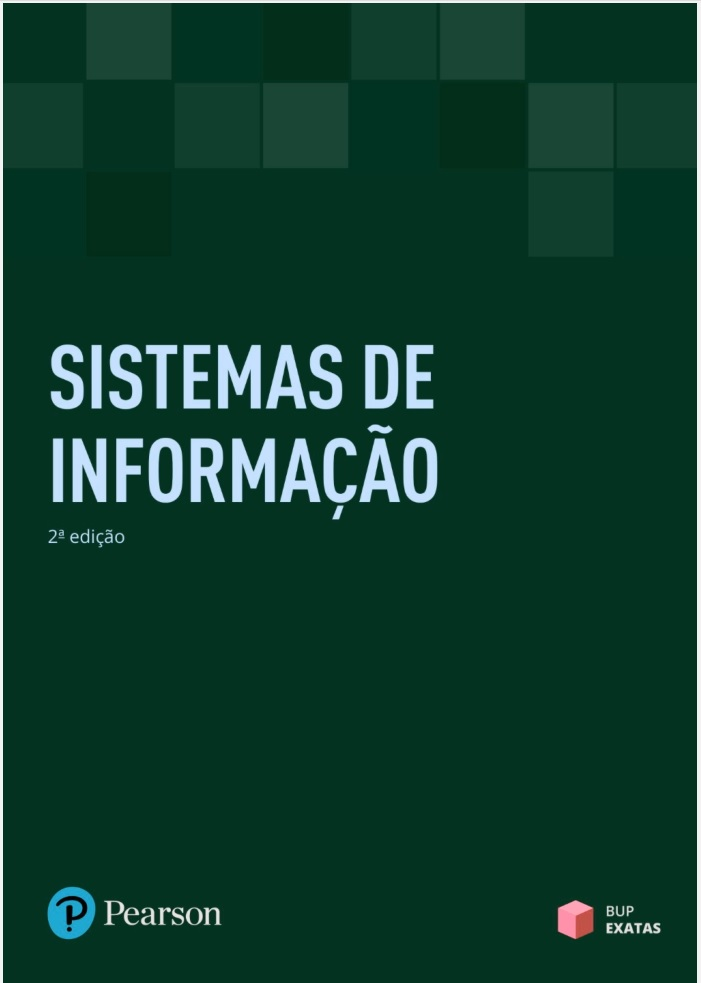

# INTRODUÇÃO DA DISCIPLINA {.unnumbered}

coming soon

## Livros-Texto da disciplina

### Bibliografia Básica

{width="291"}

( JOÃO, Belmiro N. Sistemas de Informação - São Paulo: Pearson Education do Brasil, 2019.)

JOÃO, Belmiro N. Informática Aplicada. São Paulo: Pearson Education do Brasil, 2019.

GONÇALVES, G. R. B. Sistemas de informação. Porto Alegre: SAGAH, 2017.

SILVA, K. C. N.; BARBOSA, C.; CÓRDOVA JUNIOR, R. S. Sistemas de informações gerenciais. Porto Alegre: SAGAH, 2018.

### Bibliografia Complementar

LAUDON, Kenneth C; LAUDON, Jane P. Sistemas de Informação Gerenciais. São Paulo: Pearson Education do Brasil, 2014.

MUNHOZ, Antônio S. Fundamentos de Tecnologia da Informação e análise de sistemas para não analistas. Curitiba: Intersaberes, 2017.

MARÇULA, M.; BENINI FILHO, P. A. Informática: Conceitos e Aplicações. 5.Ed. São Paulo: Erica: 2019.

RAINER JUNIOR, R. K.; CEGIELSKI, C. G. Introdução a sistemas de informação. - 5. ed. - Rio de Janeiro: Elsevier, 2016.

STAIR, Ralph M; REYNOLDS, George W. Princípios de sistemas de informação / Ralph M. Stair. São Paulo: Cengage Learning, 2015.

## CALENDÁRIO DE AULAS E PROVAS

### Chácara Santo Antônio

**Fevereiro 2025**

| No. | fevereiro 2025 |    Semana     | conteúdo  |
|:---:|:--------------:|:-------------:|:---------:|
| 01  |   17/02/2025   | Segunda-feira | Inaugural |
| 02  |   24/02/2025   | Segunda-feira |  Aula 01  |

**Março 2025**

| No. | Março 2025 |    Semana     | conteúdo |
|:---:|:----------:|:-------------:|:--------:|
| 03  | 03/03/2025 | Segunda-feira | Feriado  |
| 04  | 10/03/2025 | Segunda-feira | Aula 02  |
| 05  | 17/03/2025 | Segunda-feira | Aula 03  |
| 06  | 24/03/2025 | Segunda-feira | Aula 04  |
| 07  | 31/03/2025 | Segunda-feira |   NP1    |

**Abril 2025**

| No. | Abril 2025 |    Semana     | conteúdo |
|:---:|:----------:|:-------------:|:--------:|
| 08  | 07/04/2025 | Segunda-feira | Aula 05  |
| 09  | 14/04/2025 | Segunda-feira | Aula 06  |
| 10  | 21/04/2025 | Segunda-feira | Aula 07  |
| 11  | 28/04/2025 | Segunda-feira | Aula 08  |

**maio 2025**

| No. | Maio 2025  |    Semana     | conteúdo |
|:---:|:----------:|:-------------:|:--------:|
| 12  | 05/05/2025 | Segunda-feira | Aula 09  |
| 13  | 12/05/2025 | Segunda-feira | Aula 10  |
| 14  | 19/05/2025 | Segunda-feira |   NP2    |
| 15  | 26/05/2025 | Segunda-feira |   SUB    |

**junho 2025**

| No. | Junho 2025 |    Semana     | conteúdo |
|:---:|:----------:|:-------------:|:--------:|
| 12  | 02/06/2025 | Segunda-feira | PLANTÃO  |
| 13  | 09/06/2025 | Segunda-feira | PLANTÃO  |
| 14  | 16/06/2025 | Segunda-feira |  EXAME   |
| 15  | 23/06/2025 | Segunda-feira |  VISTAS  |

### Marquês de São Vicente

**Fevereiro 2025**

| No. | Fevereiro 2025 |    Semana    | conteúdo  |
|:---:|:--------------:|:------------:|:---------:|
|  1  |   05/02/2025   | Quarta-feira |           |
|  1  |   05/02/2025   | Quarta-feira |           |
|  2  |   12/02/2025   | Quarta-feira |           |
|  3  |   19/02/2025   | Quarta-feira | Inaugural |
|  4  |   26/02/2025   | Quarta-feira |  Aula 01  |

**Março 2025**

| No. | Março 2025 |    Semana    | conteúdo |
|:---:|:----------:|:------------:|:--------:|
|  5  | 05/03/2025 | Quarta-feira | Feriado  |
|  6  | 12/03/2025 | Quarta-feira | Aula 02  |
|  7  | 19/03/2025 | Quarta-feira | Aula 03  |
|  8  | 26/03/2025 | Quarta-feira | Aula 04  |

**Abril 2025**

| No. | Abril 2025 |    Semana    | conteúdo |
|:---:|:----------:|:------------:|:--------:|
|  9  | 02/04/2025 | Quarta-feira |   NP1    |
| 10  | 09/04/2025 | Quarta-feira | Aula 05  |
| 11  | 16/04/2025 | Quarta-feira | Aula 06  |
| 12  | 23/04/2025 | Quarta-feira | Aula 07  |
| 13  | 30/04/2025 | Quarta-feira | Aula 08  |

**Maio 2025**

| No. | Maio 2025  |    Semana    | conteúdo |
|:---:|:----------:|:------------:|:--------:|
| 14  | 07/05/2025 | Quarta-feira | Aula 09  |
| 15  | 14/05/2025 | Quarta-feira | Aula 10  |
| 16  | 21/05/2025 | Quarta-feira |   NP2    |
| 17  | 28/05/2025 | Quarta-feira |   SUB    |

**Junho 2025**

| No. | Junho 2025 |    Semana    | conteúdo |
|:---:|:----------:|:------------:|:--------:|
| 18  | 04/06/2025 | Quarta-feira | PLANTÃO  |
| 19  | 11/06/2025 | Quarta-feira | PLANTÃO  |
| 20  | 18/06/2025 | Quarta-feira |  EXAME   |
| 21  | 25/06/2025 | Quarta-feira |  VISTAS  |

## ALUNOS

### Chácara Santo Antônio

### Marquês de São Vicente
