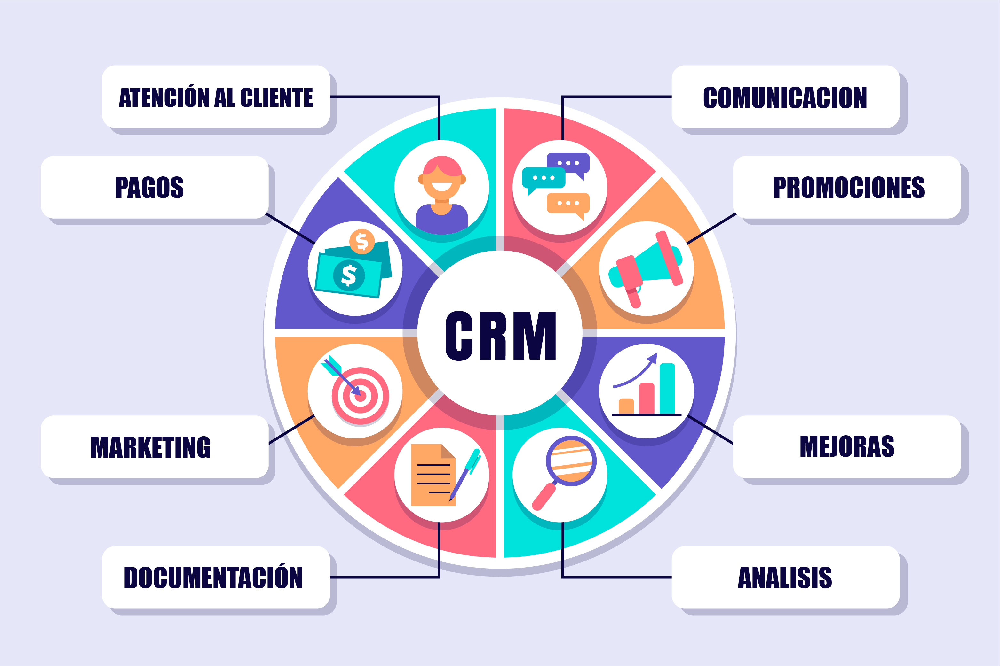

# INTRODUÇÃO A TIC (TECNOLOGIA DA INFORMAÇÃO E COMUNICAÇÕES)

## Conceitos de Sistemas de Informação

### O Dado

Conceito de Dados (DATA) segundo Prof **Belmiro Nascimento João - USP - (autor SISTEMAS DA INFORMAÇÃO - 2a edição 2017)**

{width="131"}

> *Dados são sequências de fatos ainda não analisados, antes de serem organizados e ar­ ranjados de um jeito que as pessoas possam compreendê-los.* (João, Belmiro Nascimento - 2017)

> *Informação é um dado organizado e apresentado de forma útil.* (João, Belmiro Nascimento - 2017)

Exemplo de Dados versus Informação:

As caixas dos supermercados registram milhões de dados, como o código de barras dos produtos. Se somarmos e analisarmos esses dados, pode­ mos obter informações significativas, como o número total de detergentes vendidos em uma loja ou as vendas por região.

Fonte: LAUDON E LAUDON (2011, Pág 13)

#### Conceito de Informação segundo *Kenneth C. LAUDON, Jane P. LAUDON* (2011)

> *"Tecnicamente, um **sistema de informação (Si)** é um CONJUNTO DE COMPONENTES RELACIONADOS entre si que COLETAM (ou recuperam), PROCESSAM, ARMAZENAM c DISTRIBUEM [o que ?] INFORMAÇÕES que servem para apoiar a TOMADA DE DECISÕES, a COORDENAÇÃO e o CONTROLE de uma organização." (LAUDON; LAUDON, 2011)*

PERGUNTA: *Um **SISTEMA DE INFORMAÇÃO (SI)** é a mesma coisa que um **computador (smartphone) com um software (app)***?

a ) sim ? Porque ?\_\_\_\_\_\_\_\_\_\_\_\_\_\_\_\_\_\_\_\_\_\_\_\_\_\_\_\_\_\_\_\_\_\_\_\_\_\_\_\_\_\_\_\_\_\_\_\_\_\_\_\_\_\_\_\_\_\_\_\_\_\_\_\_\_\_\_\_\_\_\_\_\_\_\_\_\_\_\_\_\_\_\_\_\_\_\_\_\_

b)  nâo ? Porque ?\_\_\_\_\_\_\_\_\_\_\_\_\_\_\_\_\_\_\_\_\_\_\_\_\_\_\_\_\_\_\_\_\_\_\_\_\_\_\_\_\_\_\_\_\_\_\_\_\_\_\_\_\_\_\_\_\_\_\_\_\_\_\_\_\_\_\_\_\_\_\_\_\_\_\_\_\_\_\_\_\_\_\_\_\_\_\_\_\_

### As 3 atividades básicas de um Sistema de Informação (SI)

### Os Sistemas de Informação e o Mundo dos Negócios

Em uma visão global, segundo JOAO, BELMIRO NASCIMENTO (2018) os Sistemas de Informação dentro das organizações são

> soluções para vários problemas e desafios organizacionais. Essa abordagem tem relevância direta para sua carreira, pois **seus futu­ros empregadores contratarão você por sua habilidade em resolver problemas e atingir objetivos**.(JOÃO, BELMIRO NASCIMENTO - 2018)

### A abordagem da resolução de problemas organizacionais

No mundo dos negócios as demandas (ou problemas) podem ser agrupados em 3 categorias:

-   organização;

-   tecnologia;

-   pessoas;

Segundo *Kenneth C. LAUDON, Jane P. LAUDON,* solucionar probelmas será sempre um processo contínuo de 4 passos:

1.  Identificar [do problema ou demanda];

2.  Receber as propostas para Solução [do problema ou demanda];

3.  Avaliar as propostas e escolher a Solução [do problema ou demanda];

4.  Implantar a SOLUÇÂO escolhida [para resolver o problema ou demanda];

+---------------------------------------------------------+-----------------------------------------------------------------------------------------------------+
| Os 4 passos para solucionar problemas (LAUDON e LAUDON) | Detalhes                                                                                            |
+=========================================================+=====================================================================================================+
| 1- Identificar [problema ou demanda]                    | -   Como resolver um problema que não sabemos qual é?                                               |
|                                                         |                                                                                                     |
|                                                         | -   Os problemas precisam ser definidos pelas pessoas em uma orga­nização antes de serem resolvidos. |
+---------------------------------------------------------+-----------------------------------------------------------------------------------------------------+
| 2- Propor Solução [problema ou demanda]                 | -   Identificar soluções viáveis; Custo                                                             |
|                                                         |                                                                                                     |
|                                                         | -   Evitar "bazuca para matar um pardal";                                                           |
|                                                         |                                                                                                     |
|                                                         | -   Usar tecnologia ou usar melhor o "recurso humano" ?                                             |
+---------------------------------------------------------+-----------------------------------------------------------------------------------------------------+
| 3- Avaliar Propostas [problema ou demanda]              | -   Eficiência vs Eficácia !                                                                        |
+---------------------------------------------------------+-----------------------------------------------------------------------------------------------------+
| 4- Implantação [problema ou demanda]                    | -   Qual a melhor solução ? Geralmente aquela que atende e é mais fácil de ser implantada;          |
+---------------------------------------------------------+-----------------------------------------------------------------------------------------------------+

## Os diferentes Tipos de Sistemas de Informação

**Empresa existe para** (**cumprir seu propósito** que geralmente é) **DAR LUCRO** !

#### Organizações com fins lucrativos - Empresas

Uma empresa é uma organização formal cujo ob­ jetivo é produzir produtos ou prestar serviços a fim de obter lu­ cro. E como obter lucro? A conta é simples: vendem-se produtos a um preço superior aos custos da produção.

#### Organizações sem fins lucrativos - Fundações Autarquicas - ONGs - Assitência Social - Saúde - Educação - Cultura - Direitos Humanos

As entidades sem fins lucrativos (dentre as quais estão ONGs ) são organizações que têm como objetivo principal promover o bem-estar social, defender causas ou oferecer serviços à comunidade, sem visar lucro financeiro.

#### Organograma de uma Empresa: Uma Representação Visual da Estrutura Organizacional

Um organograma é uma representação gráfica da estrutura interna de uma organização, mostrando a hierarquia, os cargos, as funções e os departamentos que a compõem. Ele serve como um **mapa visual** da organização, facilitando a compreensão de **como as diferentes partes se encaixam** e como o **poder e a responsabilidade são distribuídos**.

#### Organograma Conceitual

**Organograma Empresarial - Varejo**

**Organograma Empresarial - Indústria**

Aparece uma "organela" responsável por PRODUÇÃO

**Organograma Organizacional - Organização Sem Fins Lucrativos - Orgão Público**

Exemplo: organograma da Superintendência Estadual de São Paulo do IBGE - Fundação pública da esfera do Poder Executivo Federal

**Missão** institucional dessa "organização" federal "*Retratar o Brasil com informações necessárias ao conhecimento de sua realidade e ao exercício da cidadania*"

### Organizando uma organização tipo empresa: funções empresariais básicas

Imagine que você queira abrir seu próprio negócio. Você preci­ sará tomar várias decisões: o que produzir ou qual serviço prestar. Essa é uma escolha estratégica, pois vai determinar seus prováveis consumidores, os funcionários de que precisa, os métodos de pro­ dução c muitos outros aspectos. Depois de decidir o que produzir, você deve definir de que tipo de organização vai necessitar. Primeiro, pense em um arranjo de pessoas, máquinas c processos de negócios capaz de produzir. Em segundo lugar, monte uma equipe de marketing e vendas capaz de atrair clientes e vender o produto. Em terceiro, após as vendas, é preciso organizar uma equipe de contabilidade e finanças para cuidar das transações financeiras correntes, como pedidos, faturas e folhas de pagamento. Calma, ainda não acabou: também são necessárias pessoas para cuidar dos assuntos relativos aos funcio­ nários, como recrutamento e capacitação.

Essas quatro funções básicas - que você poderá ver na figura abaixo são encontradas em qualquer empresa. A figura também ajuda a identificar as princi­ pais entidades que formam uma empresa: fornecedores, clientes, funcionários, os salários que ela paga e, é claro, os produtos e serviços que produz.

Fonte: adaptada de Laudon e Laudon (2011, página 37).

> Organização -\> Conhecimento do Negócio -\> Processos Mapeados -\> Sistema de Informação Mapeado

Processos do Cliclo de Vida da Produção de um produto (Indústria)

## Sistemas de Informação e Vantagem Competitiva

## Tipos de sistemas de informação empresariais

### Sistemas integrados (E.R.P. - Planejamento de Recursos Empresariais ou Enterprise Resource Planning )

{width="603"}

O termo ERP foi cunhado pelo Gartner Group em 1990. Um sistema ERP, segundo Davenport (1998)

> " ***ERP é um sistema de software que integra todas as áreas funcionais de uma empresa, desde finanças e contabilidade até produção e vendas.*** " Davenport, T. H. (1998). Putting the enterprise into the enterprise system. Harvard business review, 76(4), 121-131.

As principais funções de um sistema ERP em empresas do varejo são:

-   Centralizar a gestão operacional

-   Gerir o estoque e os suprimentos

-   Emitir notas fiscais

-   Controlar as finanças

-   Cadastrar clientes e produtos

-   Administrar a empresa

Alguns exemplos de SIs ERPs, em 2025, são:

-   Pacote [SAP ERP](https://www.sap.com/brazil/products/erp.html);

-   Pacote [Oracle ERP Cloud](https://www.oracle.com/br/erp/);

-   Pacote [Microsoft Dynamics 365](https://www.microsoft.com/pt-br/dynamics-365/pricing-overview);

-   Pacote [Infor ERP](https://www.infor.com/pt-br);

-   Pacote [NetSuite ERP](https://www.netsuite.com/portal/br/products/erp.shtml);

-   Sistema ERP [TOTVS](https://www.totvs.com/sistema-de-gestao/);

-   Sistema ERP Web [BLING](https://www.bling.com.br/);

### Sistemas de gestão da cadeia de suprimentos (supply chain management - SCM)

{width="714"}

Os SI SCM são ferramentas essenciais para otimizar o fluxo de produtos, informações e finanças desde a origem até o consumidor final. Eles abrangem todas as etapas da cadeia de suprimentos, desde a aquisição de matérias-primas até a entrega do produto final ao cliente.

Segundo Simchi-Levi, D., Kaminsky, P., & Simchi-Levi, E. (2008)

> ***SCMé um SI que faz um conjunto de abordagens utilizadas para INTEGRAR eficientemente FORNECEDORES, ARMAZENS e LOJAS, de modo que as MERCADORIAS sejam PRODUZIDAS e DISTRIBUÍDAS nas QUANTIDADES certas, para os LOCAIS certos e nos MOMENTOS certos, a fim de MINIMIZAR os CUSTOS de todo o sistema, satisfazendo os requisitos de nível de serviço.*** Designing and managing the supply chain: concepts, strategies, and case studies de David Simchi-Levi, Philip Kaminsky e Edith Simchi-Levi. (2008)

As principais funções de um SI SCM são:

-   Reduzir custos: Otimizando processos, estoques e transportes.

-   Melhorar a eficiência: Agilizando o fluxo de produtos e informações.

-   Aumentar a satisfação do cliente: Garantindo entregas no prazo e produtos de qualidade.

-   Otimizar toda a cadeia de suprimentos: Interligando todas as etapas, desde fornecedores até clientes.

Alguns exemplos de SIs SCMs, em 2025, são:

-   Oracle SCM Cloud;

-   SAP SCM;

-   Blue Yonder (JDA Software);

### Sistemas de Relacionamento com Cliente - CRM (Customer Relationship Management)

{width="642"}

São SIs de análise de clientes, com o objetivo de melhorar o relacionamento, aumentar a fidelização e impulsionar as vendas. Segundo Kotler, P., & Keller, K. L. (2016), um um CRM pode ser definido assim

> ***Um SI CRM implanta o processo de gerenciar informações detalhadas sobre clientes individuais e gerenciar cuidadosamente todos os pontos de contato do cliente para maximizar a lealdade do cliente.*** Kotler, P., & Keller, K. L. (2016). Marketing management

As principais funções de um SI CRM são:

-   Coleta e organização de dados: Reunindo informações sobre clientes, histórico de compras, interações e preferências.

-   Automação de processos: Otimizando tarefas de marketing, vendas e atendimento ao cliente.

-   Análise de dados: Identificando padrões e insights para melhorar a tomada de decisões.

-   Personalização do atendimento: Oferecendo experiências individualizadas aos clientes.

Alguns exemplos de SIs CRMs, em 2025, são:

-   Salesforce CRM;

-   Microsoft Dynamics 365;

-   HubSpot CRM;

-   Zendesk Sell;
