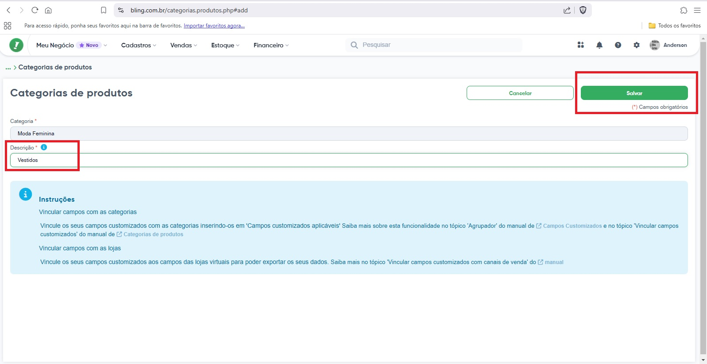
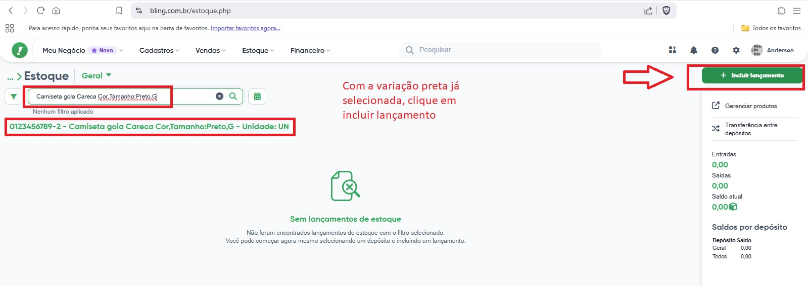
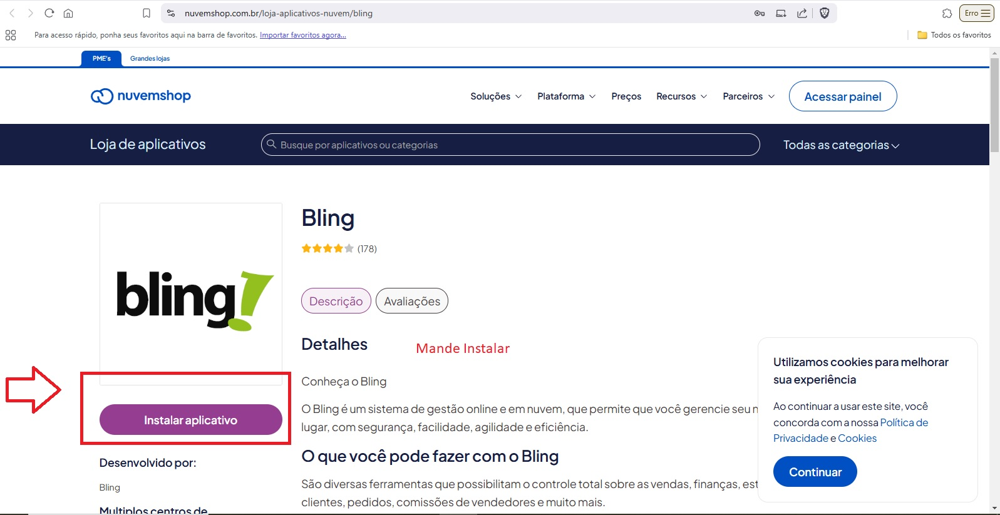
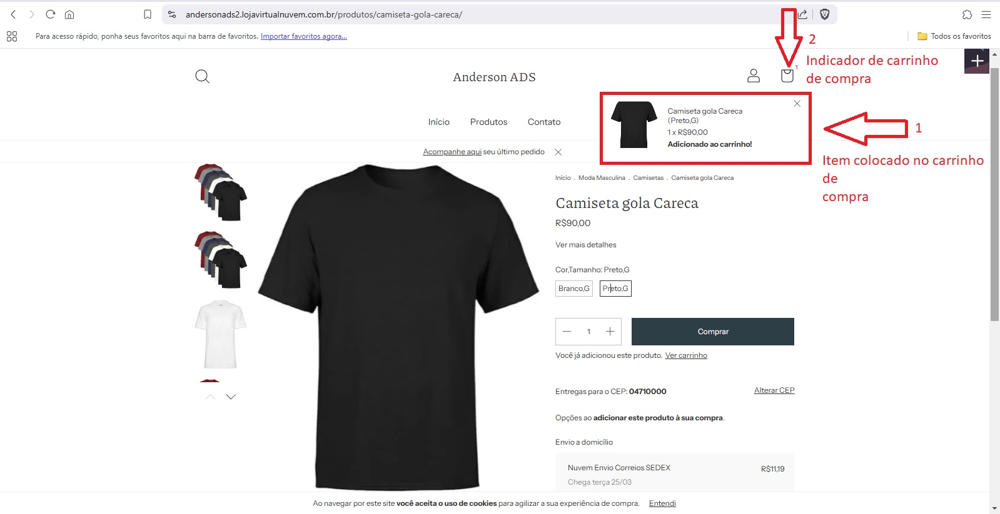

# Apresentação Trabalho NP1

Este trabalho substitui a primeira prova (NP1) do primeiro bimestre de 2025.

Este trabalho levará o aluno a fazer um estudo de mercado para obter financiamento de um investidor para montar uma EMPRESA/CONSULTORIA DE IMPLANTAÇÃO DE ERPs de terceiros.

Dinâmica: o trabalho será desenvolvido em grupo de até 4 alunos (o grupo simulará uma startup).

O trabalho deve ser entregue impresso em tamanho A4, uma cópia por aluno (como se fosse individual).

O trabalho deverá ter no mínimo 5 e no máximo 10 folhas.

## NP1 – TRABALHO DE SUBSTITUIÇÃO DE PROVA P1 - PESQUISA

### 1- CAPA

**UNIP** – UNIVERSIDADE PAULISTA

**CURSO**: TECNOLOGIA EM ANÁLISE E DESENVOLVIMENTO DE SISTEMAS

**DISCIPLINA** – TIC – TECNOLOGIA DA INFORMAÇÃO E TELECOMUNICAÇÃO

**TÍTULO**: PLANO Captação de Investimento para empresa “CONSULTORIA E IMPLANTAÇÃO ERP+ COMERCIO ELETRÔNICO” - GRUPO número “x” [onde x é definido pelo professor]

-   NOME: Integrante 1 NOME: Integrante 2 NOME: Integrante 3 NOME: Integrante 4

**PROFESSOR**: Miguel Suez Xve Penteado

### 2- Agradecimentos e dedicatórias:

NÃO VAI FAZER

### 3- Sumário:

( introdução pág x , justificativa pág y, objetivo pág z … )

### 4- Resumo:

“ESTE ESTUDO DO GRUPO X PROVOU QUE UMA EMPRESA DO RAMO DE CONSULTORIA E IMPLANTAÇÃO DE SOLUÇÃO ERP + COMERCIO ELETRÔNICO É VIAVEL, SEGUNDO LEVANTAMENTO DAS PESQUISAS X,Y,Z DO(S) ORGÃO(S) X(Y,Z) ”

### 5-Justificativa:

“ UMA VEZ COMPROVADA A DEMANDA POR IMPLANTAÇÃO DE SOFTWARE TIC ERP E CRM + SCM (REPRESENTADAS SUAS FUNCIONALIDADES NO E-COMERCE), JUSTIFICA-SE O INVESTIMENTO EM STARTUPs DESTA NAUTREZA”

### 6-Objetivo:

LEVANTAR OS DADOS QUE PROVAM AO INVESTIDOR QUE COMPENSA INVESTIR EM UMA STARTUP DE IMPLANTAÇÃO DE Sis ERP+E-COMERCE.

### 7 – introdução

SOMOS O GRUPO X, NOSSO GRUPO IMPLANTA ERPs INTEGRADOS A COMERCIO ELETRÔNICO. MAS O QUE VEM A SER UM ERP ? [EXPLICA O QUE É UM ERP SEGUNDO NOSSOS LIVROS TEXTO]. E O QUE É COMERCIO ELETRÔNICO ? [EXPLICA]. QUAL A VANTAGEM COMPETITIVA DE UMA EMPRESA QUE TEM ESSES SI(s) ? [EXPLICA E PODE USAR OS NOSSOS LIVROS-TEXTO COMO REFERÊNCIA]

### 8- Revisão Bibliográfica:

“EMPRESAS DE CONSULTORIA EM TIC PARA IMPLANTAÇÃO DE SISTEMAS TIPO ERP E COMERCIO ELETRÔNICO DÃO LUCRO EM 2025. SEGUNDO AS ÚLTIMAS PESQUISAS …. FOI COMPROVADO A NECESSIDADE DA POPULAÇÃO EM TAL TIPO DE SOFTWARE, E POR CONSEQUÊNCIA, EMPRESAS QUE IMPLANTAM ESSE TIPO DE SOFTWARE DÃO LUCRO…”

Segundo **A PESQUISA 1** – TANTAS EMPRESAS SE INFORMATIZARAM NOS ULTIMOS 5 ANOS.., SEGUNDO **A PESQUISA 2**, TANTAS PESSOAS COMPRARAM DA INTERNET NOS ULTIMOS 5 ANOS. SEGUNDO **A PESQUISA 3**, HÁ TANTAS PESSOAS BUSCANDO ENSINO A DISTÂNCIA

### 9-Materiais e Métodos

COLHI TAL **DADO**, E CHEGUEI A TAL **INFORMAÇÃO** DE TAL PESQUISA;

### 10-Resultados

PODEMOS CONCLUIR O **CONHECIMENTO1** DE QUE … A PARTIR DA **INFORMAÇÃO1**;

PODEMOS CONCLUIR O **CONHECIMENTO2** DE QUE … A PARTIR DA **INFORMAÇÃO2**;

PODEMOS CONCLUIR O **CONHECIMENTO3** DE QUE … A PARTIR DA **INFORMAÇÃO3**;

### 11- Discussão

O **CONHECIMENTO1** JUSTIFICA O INVESTIMENTO NA NOSSA STARTUP DO GRUPO X, QUE IMPLANTA Sis ERP+COMÉRCIO ELETRÔNICO;

O **CONHECIMENTO2** JUSTIFICA O INVESTIMENTO NA NOSSA STARTUP DO GRUPO X, QUE IMPLANTA Sis ERP+COMÉRCIO ELETRÔNICO;

### 12-Conclusão

POR ISSO TUDO, OU SEJA CONHECIMENTO1, CONHECIMENTO2, CONHECIMENTO3… COMPROVAMOS QUE COMPENSA O IVESTIMENTO NA EMPRESA DO GRUPO X. CONVIDO VOCÊ A SER NOSSO SÓCIO;

### 13-Referencias Bibliográficas

PESQUISA 1...

PESQUISA 2...

PESQUISA 3...

### Apendice - links de pesquisas de TIC no Brasil

| Pesquisa do CETIC - NIC.br | Endereço |
|:----------------------------------:|------------------------------------|
| TIC – DOMICÍLIOS | <https://cetic.br/pesquisa/domicilios/> |
| TIC – EMPRESAS | <https://cetic.br/pt/pesquisa/empresas/> |
| TIC – EDUCAÇÃO | <https://cetic.br/pt/pesquisa/educacao/> |
| TIC – SAÚDE | <https://cetic.br/pt/pesquisa/saude/> |
| TIC – ORGANIZAÇÕES SEM FINS LUCRATIVOS | <https://cetic.br/pt/pesquisa/osfil/> |
| TIC – GOVERNO ELETRÔNICO | <https://cetic.br/pt/pesquisa/governo-eletronico/> |

: Pesquisas TIC do CETIC (NIC.br)

| Pesquisa do IBGE | Endereço |
|------------------------------------|------------------------------------|
| IBGE – PESQUISA TIC – EMPRESA – 2010 | <https://www.ibge.gov.br/estatisticas/multidominio/ciencia-tecnologia-e-inovacao/9137-pesquisa-sobre-o-uso-das-tecnologias-de-informacao-e-comunicacao-nas-empresas.html?=&t=o-que-e> |
| IBGE – PESQUISA PINTEC – INOVAÇÃO TECNOLÓGICA | <https://www.ibge.gov.br/estatisticas/multidominio/ciencia-tecnologia-e-inovacao/9141-pesquisa-de-inovacao.html> |
| IBGE - PSTI – PESQUISA DE SERVIÇOS DE TIC – MODALIDADE SEMESTRAL | <https://www.ibge.gov.br/estatisticas/multidominio/ciencia-tecnologia-e-inovacao/9037-pesquisa-de-servicos-de-tecnologia-da-informacao.html?=&t=o-que-e> |

: Pesquisas TIC do IBGE

**LEMBRANDO QUE:**

**Dados** *são sequências de fatos ainda não analisados, antes de serem organizados e ar­ ranjados de um jeito que as pessoas possam compreendê-los.*

**Informação** *é um dado organizado e apresentado de forma útil.*

**Conhecimento** *é o resultado da aplicação da informação para tomada de decisão.*

**Regras:**

1- O trabalho deve ter no mínmo 5 e no máximo 10 PÁGINAS (se trata de **páginas** e não de **laudas**);

2- Plágio causa penalidade de nota igual a zero;

3- Data da entrega final deste trabalho: DATA DA NP1;

## Formação dos Grupos

O professor está criando as tabelas de grupos conforme a disposição que os alunos passaram e postará aqui.

## Parte Prática - Implantar um E-commerce atrelado a um ERP

Estudo de Caso:

Suponha que você tem uma **empresa (consultoria) de implantação de ERP com e-commerce**.

Neste exemplo, o nome de sua empresa (consultoria) é **DATALEVE**.

Suponha que sua Empresa de Implantação de ERP acabou de ganhar um cliente.

O nome do seu cliente é **Anderson Silva**.

Anderson Silva gostaria de **vender camisetas da com estampa da sua marca pessoal poe e-commerce**.

Ele contratou sua consultoria para implantar o ERP que irá vender as camisetas via e-commerce.

### Ter em posse os dados do cliente:

|                     |     |
|---------------------|-----|
| Nome do Cliente     |     |
| CPF do Cliente      |     |
| RG do cliente       |     |
| Endereço do Cliente |     |
| Telefone do Cliente |     |
| e-mail do cliente   |     |

: Informações da Pessoa Física (ou do sócio administrador , no caso de empresa)

Caso seja empresa (pessoa jurídica), peça mais essas informações

|                             |     |
|-----------------------------|-----|
| CNPJ do sócio administrador |     |
| Inscrição Estadual da loja  |     |
| Inscrição Municipal da Loja |     |

: Dados da empresa

## Começando a Impantação do ERP

O ERP escolhido para este estudo de caso é um ERP tipo SAAS (Software como serviço), ou seja, um software ERP WEB. A solução ERP escolhida neste estudo de caso foi o ERP BLING <https://www.bling.com.br/>. A solução de e-commerce escolhida neste estudo de caso para integrar a funcionalidade de e-commerce com o ERP anterior foi a <https://www.nuvemshop.com.br/>.

Ambas soluções oferecem planos gratuítos onde o aluno pode estudar o caso simulando um ambiente real.

### Impantando o ERP

Destaca-se que neste ambiente de simulação, não vamos explorar a parte de controle FISCAL dos ERPs. Desta forma: - Não vamos cadastrar certificados de pessoa jurídica (CNCP digital); - Portanto não vamos emitir nenhum tipo de nota fiscal; - E, portanto, não vamos cadastrar meios de pagamento eletrônicos no e-commerce;

#### Iniciar castrando seu cliente na solução ERP

Comece inserindo os dados do seu cliente no ERP

    

#### Começar a cadastrar EMPRESA (Conceito de "Módulo CONTROLE CADASTROS" dos ERPs)

##### Começar a cadastrar a EMPRESA (pessoa física ou jurídica)

  

##### Começar a cadastrar as categorias dos produtos (pessoa física ou jurídica)

         

##### Começar a cadastrar os produtos (pessoa física ou jurídica)

              

##### Começar a cadastrar o estoque (Conceito de "Módulo CONTROLE DE ESTOQUE" dos ERPs)

          

#### Começar a cadastrar PDV (Ponto de Venda) da parte física da loja (Conceito de "Módulo de vendas - PDV" dos ERPs)

    

### Impantando o E-COMMERCE (parte virtual loja)

### ATIVE a PLATAFORMA DE E-COMMERCE

#### cadastre a empresa do cliente na platafroma de e-commerce

    

#### cadastre as categorias de produtos na loja on-line

     

#### mapeie o código das categorias de produtos na loja on-line para colocar no ERP depois

     

### Inicie a amarração (integração) do e-commerce com o ERP (começando no e-commerce)

#### Instale o aplicativo (API) de conexão no e-commerce

   

#### Instale o aplicativo (API) de conexão no ERP

      

#### Faça agora o mapeamento do código das categorias do e-commerce no ERP

   

#### Faça agora a exportação dos produtos

     

#### Parabéns, hora de começar a testar seu e-commerce.

### INICIANDO O PROCESSO DE VENDA SIMULADA NO E-COMMERCE INTEGRADO AO ERP:

#### Configurar no e-commerce um ou mais MEIO(s) DE PAGAMENTO

No e-commerce (nuvemshop nesse caso) vá atá a aba de configuração.

Procure pelo menu "Meio de Pagamento"

Aqui temos várias opções disponíveis para o dinheiro vir do comprador até a empresa (seu cliente) dona do site de e-commerce:

1.  Cartões de Débito ( Via "mercado pago", "núvem pago", "Cielo", "Rede" etc )

2.  Cartões de Crédito ( Via "mercado pago", "núvem pago", "Cielo", "Rede" etc

3.  Via boleto

4.  Via PIX

5.  (pesonalizado) Via troca de conversa whatsapp, onde manualmente o cliente termina a compra, pega a chave pix da loja virtual pelo whatsapp ou e-mail por exemplo, paga e envia o comprovante no whatsapp ou e-mail da loja virtual/e-commerce. Nessa modalidade, não há necessidade de se cadastrar em meios de pagamento, e portanto, não há cobrança de taxas pelos meios-de-pagamento. Utilizaremos esse método para nosso estudo de caso.

Localize o meio de pagamento personalizado

Ative esse tipo de meio-de-pagamento.

Ative apenas a opção "A combinar" (referente a fazer a conferência de pagamento manualmente).

Pronto. Apenas confirme que seu meio de pagamento está configurado e ativado.

#### Simulação do comprador comprando uma camiseta

#### Aprovação manual da compra

##### Cliente recebe status da compra (pedido e status de pagamento)

Neste ponto o comprador recebe um e-mail informando:

|                         |                                       |
|-------------------------|---------------------------------------|
| **Número do pedido**    | No caso esse número é o #100          |
| **Status do pagamento** | Informa que está aguardando pagamento |

##### Cliente manda comprovante de pagamento

##### parte 01 - liberação pedido de venda no e-commerce

##### parte 02 - Fechar venda no ERP ( dar baixa no estoque e lançamento de contas )

OBS: conforme combiando, por razões de limitações do estduo de caso, não vamos emitir nota fiscal para esta venda.

Acesse o módulo de vendas. Entre em pedidos de venda.

Veja qu o sistema já puxou a venda do e-commerce, mas pelo processo estar no "modo manual", precisamos fazer o sistema:

| Ações manuais sobre a venda | Descrição e importância |
|------------------------------------|------------------------------------|
| 1- Atualizar o estoque | De 2 camisetas pretas existentes na loja, 1 foi vendida, portanto restando apenas 1 para vender |
| 2- Atualizar as contas | O valor da venda, sem o frente, foi de R\$ 90,00. Portanto entrou R\$ 90,00 nas contas a receber. |
| 3- Fechar a venda dentro do ERP | Regra de ERP: para pode emitir nota fiscal e mandar embalar a camiseta, é preciso fechar o pedido primeiro. |

Verifique o status atual da sua venda que foi recebida do e-commerce:

Atualize o estoque seguindo os passos abaixo:

Atualize as contas seguindo os passos abaixo:

Feche a venda seguindo os passos abaixo

Coloque uma observação (já que você fez o processo manualmente).

Pronto, agora é só verificar a sua venda finalizada.

Parabéns para você que chegou aqui!

Você implantou um e-commerce gerenciado por ERP para um cliente.

## CASO DE SUCESSO NO BRASIL DE UMA STARTUP, NESSE CASO ESPECÍFICAMENTE, DE I.A.

### Fundada por brasileiro, CrewAI capta R\$ 100M e atrai CEO da OpenAI

A matéria completa está em <https://startups.com.br/negocios/fundada-por-brasileiro-crewai-capta-r-100m-e-atrai-ceo-da-openai/>

### CrewAI: Um guia com exemplos de sistemas de múltiplos agentes de IA

Como testar a ferramenta crewai através dos pacotes python `crewai-tools crewai`

<https://www.datacamp.com/pt/tutorial/crew-ai>

## Lista de 100 Startups Brasileiras de Sucesso

| **id**  |       **Nome**       | Área de Atuação                              |
|:------------:|:-------------:|-------------------------------------------|
|  **1**  |      **Nubank**      | Serviços financeiros digitais                |
|  **2**  |      **iFood**       | Entrega de comida e mercado                  |
|  **3**  |   **QuintoAndar**    | Plataforma de aluguel e compra de imóveis    |
|  **4**  |       **Loft**       | Compra e venda de imóveis                    |
|  **5**  |     **Creditas**     | Empréstimos com garantia                     |
|  **6**  |     **Gympass**      | Plataforma de bem-estar e atividades físicas |
|  **7**  |  **MadeiraMadeira**  | Venda online de móveis e artigos para casa   |
|  **8**  |       **VTEX**       | Plataforma de comércio digital               |
|  **9**  |      **CargoX**      | Plataforma de logística e transporte         |
| **10**  |       **Neon**       | Banco digital                                |
| **11**  |      **EBANX**       | Processamento de pagamentos                  |
| **12**  |     **Hotmart**      | Plataforma de produtos digitais              |
| **13**  |      **Loggi**       | Logística para e-commerce                    |
| **14**  | **Wildlife Studios** | Desenvolvimento de jogos                     |
| **15**  |      **Stone**       | Soluções de pagamento                        |
| **16**  |    **RD Station**    | Automação de marketing e vendas              |
| **17**  |    **Conta Azul**    | Software de gestão para pequenas empresas    |
| **18**  |   **Descomplica**    | Educação online                              |
| **19**  |      **Facily**      | E-commerce social                            |
| **20**  |      **Olist**       | Plataforma para vendas online                |
| **21**  |      **Docket**      | Gestão de documentos                         |
| **22**  |      **Alice**       | Plano de saúde                               |
| **23**  |       **Daki**       | Supermercado online                          |
| **24**  |     **Hashdex**      | Gestão de criptoativos                       |
| **25**  |      **Kavak**       | Compra e venda de carros usados              |
| **26**  |      **unico**       | Identidade digital                           |
| **27**  |      **Buser**       | Transporte rodoviário                        |
| **28**  |     **Pagar.me**     | Soluções de pagamento online                 |
| **29**  |      **Rappi**       | Entrega de diversos produtos                 |
| **30**  |   **Zé Delivery**    | Entrega de bebidas                           |
| **31**  |     **Petlove**      | Produtos e serviços para pets                |
| **32**  |       **Sami**       | Plano de saúde                               |
| **33**  |       **Kovi**       | Aluguel de carros por assinatura             |
| **34**  |      **Warren**      | Plataforma de investimentos                  |
| **35**  |      **Liv Up**      | Alimentação saudável                         |
| **36**  |      **Trybe**       | Escola de programação                        |
| **37**  |      **Amaro**       | E-commerce de moda                           |
| **38**  |      **Cortex**      | Inteligência de dados                        |
| **39**  |  **Infracommerce**   | Soluções para e-commerce                     |
| **40**  |       **Gupy**       | Recrutamento e seleção                       |
| **41**  | **Flash Benefícios** | Benefícios corporativos                      |
| **42**  |      **Méliuz**      | Cashback e cupons                            |
| **43**  |       **Omie**       | Software de gestão para PMEs                 |
| **44**  |   **Dr. Consulta**   | Clínicas populares                           |
| **45**  |     **Zenklub**      | Saúde mental                                 |
| **46**  |      **PicPay**      | Carteira digital                             |
| **47**  |  **Creditas Auto**   | Empréstimos com garantia de veículo          |
| **48**  |        **99**        | Aplicativo de mobilidade urbana              |
| **49**  |     **C6 Bank**      | Banco digital                                |
| **50**  |    **CloudWalk**     | Pagamentos digitais                          |
| **51**  | **Neon Pagamentos**  | Banco digital                                |
| **52**  |  **Quero Educação**  | Educação                                     |
| **53**  |       **Loft**       | Plataforma de compra e venda de imóveis      |
| **54**  |     **Creditas**     | Plataforma de empréstimos online             |
| **55**  |     **Gympass**      | Plataforma de bem-estar corporativo          |
| **56**  |  **MadeiraMadeira**  | E-commerce de produtos para casa             |
| **57**  |       **VTEX**       | Plataforma de e-commerce                     |
| **58**  |      **CargoX**      | Plataforma de transporte de cargas           |
| **59**  | **Neon Pagamentos**  | Banco digital                                |
| **60**  |      **EBANX**       | Processamento de pagamentos                  |
| **61**  |     **Hotmart**      | Plataforma de produtos digitais              |
| **62**  |      **Loggi**       | Logística para e-commerce                    |
| **63**  | **Wildlife Studios** | Desenvolvimento de jogos                     |
| **64**  |      **Stone**       | Soluções de pagamento                        |
| **65**  |    **RD Station**    | Plataforma de automação de marketing         |
| **66**  |    **Conta Azul**    | Software de gestão para pequenas empresas    |
| **67**  |   **Descomplica**    | Educação online                              |
| **68**  |      **Facily**      | Plataforma de compras online                 |
| **69**  |      **Olist**       | Plataforma de vendas online                  |
| **70**  |      **Docket**      | Plataforma de gestão de documentos           |
| **71**  |      **Alice**       | Plano de saúde                               |
| **72**  |       **Daki**       | Supermercado online                          |
| **73**  |     **Hashdex**      | Gestão de criptoativos                       |
| **74**  |      **Kavak**       | Compra e venda de carros usados              |
| **75**  |      **unico**       | Plataforma de identidade digital             |
| **76**  |      **Buser**       | Transporte rodoviário                        |
| **77**  |     **Pagar.me**     | Soluções de pagamento online                 |
| **78**  |      **Rappi**       | Aplicativo de entrega                        |
| **79**  |   **Zé Delivery**    | Entrega de bebidas                           |
| **80**  |     **Petlove**      | E-commerce de produtos para pets             |
| **81**  |       **Sami**       | Plano de saúde                               |
| **82**  |       **Kovi**       | Aluguel de carros por assinatura             |
| **83**  |      **Warren**      | Plataforma de investimentos                  |
| **84**  |      **Liv Up**      | Plataforma de alimentação saudável           |
| **85**  |      **Trybe**       | Escola de programação                        |
| **86**  |      **Amaro**       | E-commerce de moda                           |
| **87**  |      **Cortex**      | Plataforma de inteligência de dados          |
| **88**  |  **Infracommerce**   | Soluções para e-commerce                     |
| **89**  |       **Gupy**       | Plataforma de recrutamento e seleção         |
| **90**  | **Flash Benefícios** | Plataforma de benefícios corporativos        |
| **91**  |      **Méliuz**      | Plataforma de cashback e cupons              |
| **92**  |       **Omie**       | Software de gestão para pequenas empresas    |
| **93**  |   **Dr. Consulta**   | Clínicas populares                           |
| **94**  |     **Zenklub**      | Plataforma de saúde mental                   |
| **95**  |      **PicPay**      | Carteira digital                             |
| **96**  |  **Creditas Auto**   | Empréstimos com garantia de veículo          |
| **97**  | **Neon Pagamentos**  | Banco digital                                |
| **98**  |        **99**        | Aplicativo de mobilidade urbana              |
| **99**  |     **C6 Bank**      | Banco digital                                |
| **100** |    **CloudWalk**     | Pagamentos digitais                          |
