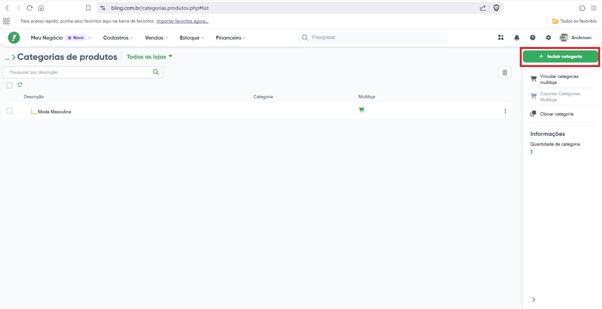
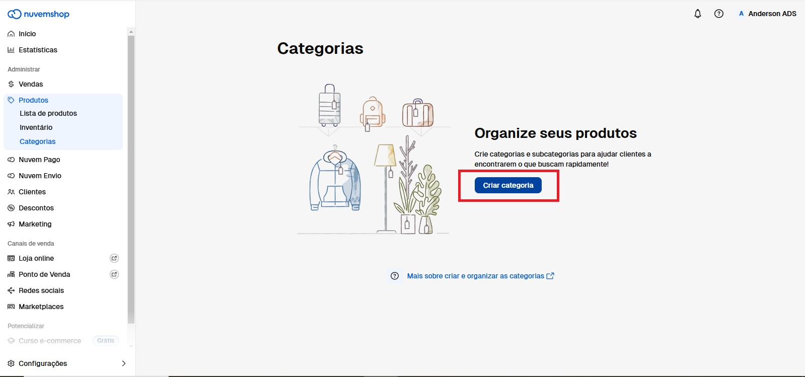
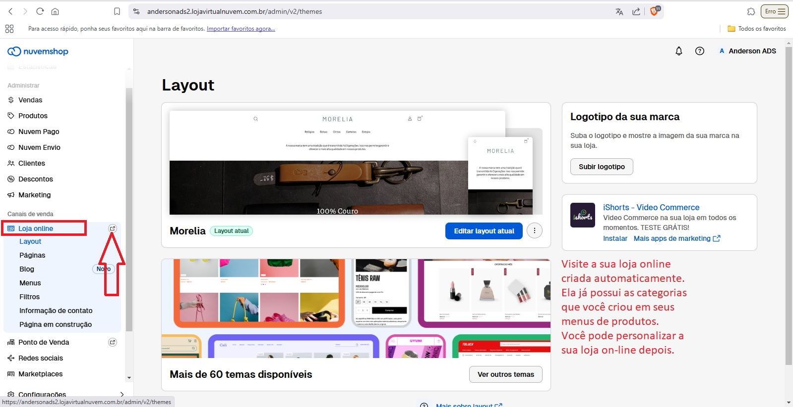

# Apresentação Trabalho NP1

Este trabalho substitui a primeira prova (NP1) do primeiro bimestre de 2025.

Este trabalho levará o aluno a fazer um estudo de mercado para obter financiamento de um investidor para montar uma EMPRESA/CONSULTORIA DE IMPLANTAÇÃO DE ERPs de terceiros.

Dinâmica: o trabalho será desenvolvido em grupo de até 4 alunos (o grupo simulará uma startup).

O trabalho deve ser entregue impresso em tamanho A4, uma cópia por aluno (como se fosse individual).

O trabalho deverá ter no mínimo 5 e no máximo 10 folhas.

## NP1 – TRABALHO DE SUBSTITUIÇÃO DE PROVA P1 - PESQUISA

### 1- CAPA

**UNIP** – UNIVERSIDADE PAULISTA

**CURSO**: TECNOLOGIA EM ANÁLISE E DESENVOLVIMENTO DE SISTEMAS

**DISCIPLINA** – TIC – TECNOLOGIA DA INFORMAÇÃO E TELECOMUNICAÇÃO

**TÍTULO**: PLANO Captação de Investimento para empresa “CONSULTORIA E IMPLANTAÇÃO ERP+ COMERCIO ELETRÔNICO” - GRUPO número “x” [onde x é definido pelo professor]

-   NOME: Integrante 1
    NOME: Integrante 2 NOME: Integrante 3 NOME: Integrante 4

**PROFESSOR**: Miguel Suez Xve Penteado

### 2- Agradecimentos e dedicatórias:

NÃO VAI FAZER

### 3- Sumário:

( introdução pág x , justificativa pág y, objetivo pág z … )

### 4- Resumo:

“ESTE ESTUDO DO GRUPO X PROVOU QUE UMA EMPRESA DO RAMO DE CONSULTORIA E IMPLANTAÇÃO DE SOLUÇÃO ERP + COMERCIO ELETRÔNICO É VIAVEL, SEGUNDO LEVANTAMENTO DAS PESQUISAS X,Y,Z DO(S) ORGÃO(S) X(Y,Z) ”

### 5-Justificativa:

“ UMA VEZ COMPROVADA A DEMANDA POR IMPLANTAÇÃO DE SOFTWARE TIC ERP E CRM + SCM (REPRESENTADAS SUAS FUNCIONALIDADES NO E-COMERCE), JUSTIFICA-SE O INVESTIMENTO EM STARTUPs DESTA NAUTREZA”

### 6-Objetivo:

LEVANTAR OS DADOS QUE PROVAM AO INVESTIDOR QUE COMPENSA INVESTIR EM UMA STARTUP DE IMPLANTAÇÃO DE Sis ERP+E-COMERCE.

### 7 – introdução

SOMOS O GRUPO X, NOSSO GRUPO IMPLANTA ERPs INTEGRADOS A COMERCIO ELETRÔNICO. MAS O QUE VEM A SER UM ERP ? [EXPLICA O QUE É UM ERP SEGUNDO NOSSOS LIVROS TEXTO]. E O QUE É COMERCIO ELETRÔNICO ? [EXPLICA]. QUAL A VANTAGEM COMPETITIVA DE UMA EMPRESA QUE TEM ESSES SI(s) ? [EXPLICA E PODE USAR OS NOSSOS LIVROS-TEXTO COMO REFERÊNCIA]

### 8- Revisão Bibliográfica:

“EMPRESAS DE CONSULTORIA EM TIC PARA IMPLANTAÇÃO DE SISTEMAS TIPO ERP E COMERCIO ELETRÔNICO DÃO LUCRO EM 2025. SEGUNDO AS ÚLTIMAS PESQUISAS …. FOI COMPROVADO A NECESSIDADE DA POPULAÇÃO EM TAL TIPO DE SOFTWARE, E POR CONSEQUÊNCIA, EMPRESAS QUE IMPLANTAM ESSE TIPO DE SOFTWARE DÃO LUCRO…”

Segundo **A PESQUISA 1** – TANTAS EMPRESAS SE INFORMATIZARAM NOS ULTIMOS 5 ANOS.., SEGUNDO **A PESQUISA 2**, TANTAS PESSOAS COMPRARAM DA INTERNET NOS ULTIMOS 5 ANOS. SEGUNDO **A PESQUISA 3**, HÁ TANTAS PESSOAS BUSCANDO ENSINO A DISTÂNCIA

### 9-Materiais e Métodos

COLHI TAL **DADO**, E CHEGUEI A TAL **INFORMAÇÃO** DE TAL PESQUISA;

### 10-Resultados

PODEMOS CONCLUIR O **CONHECIMENTO1** DE QUE … A PARTIR DA **INFORMAÇÃO1**;

PODEMOS CONCLUIR O **CONHECIMENTO2** DE QUE … A PARTIR DA **INFORMAÇÃO2**;

PODEMOS CONCLUIR O **CONHECIMENTO3** DE QUE … A PARTIR DA **INFORMAÇÃO3**;

### 11- Discussão

O **CONHECIMENTO1** JUSTIFICA O INVESTIMENTO NA NOSSA STARTUP DO GRUPO X, QUE IMPLANTA Sis ERP+COMÉRCIO ELETRÔNICO;

O **CONHECIMENTO2** JUSTIFICA O INVESTIMENTO NA NOSSA STARTUP DO GRUPO X, QUE IMPLANTA Sis ERP+COMÉRCIO ELETRÔNICO;

### 12-Conclusão

POR ISSO TUDO, OU SEJA CONHECIMENTO1, CONHECIMENTO2, CONHECIMENTO3… COMPROVAMOS QUE COMPENSA O IVESTIMENTO NA EMPRESA DO GRUPO X. CONVIDO VOCÊ A SER NOSSO SÓCIO;

### 13-Referencias Bibliográficas

PESQUISA 1...

PESQUISA 2...

PESQUISA 3...

### Apendice - links de pesquisas de TIC no Brasil

| Pesquisa do CETIC - NIC.br | Endereço |
|:------------------------------:|----------------------------------------|
| TIC – DOMICÍLIOS | <https://cetic.br/pesquisa/domicilios/> |
| TIC – EMPRESAS | <https://cetic.br/pt/pesquisa/empresas/> |
| TIC – EDUCAÇÃO | <https://cetic.br/pt/pesquisa/educacao/> |
| TIC – SAÚDE | <https://cetic.br/pt/pesquisa/saude/> |
| TIC – ORGANIZAÇÕES SEM FINS LUCRATIVOS | <https://cetic.br/pt/pesquisa/osfil/> |
| TIC – GOVERNO ELETRÔNICO | <https://cetic.br/pt/pesquisa/governo-eletronico/> |

: Pesquisas TIC do CETIC (NIC.br)

| Pesquisa do IBGE | Endereço |
|------------------------------------|------------------------------------|
| IBGE – PESQUISA TIC – EMPRESA – 2010 | <https://www.ibge.gov.br/estatisticas/multidominio/ciencia-tecnologia-e-inovacao/9137-pesquisa-sobre-o-uso-das-tecnologias-de-informacao-e-comunicacao-nas-empresas.html?=&t=o-que-e> |
| IBGE – PESQUISA PINTEC – INOVAÇÃO TECNOLÓGICA | <https://www.ibge.gov.br/estatisticas/multidominio/ciencia-tecnologia-e-inovacao/9141-pesquisa-de-inovacao.html> |
| IBGE - PSTI – PESQUISA DE SERVIÇOS DE TIC – MODALIDADE SEMESTRAL | <https://www.ibge.gov.br/estatisticas/multidominio/ciencia-tecnologia-e-inovacao/9037-pesquisa-de-servicos-de-tecnologia-da-informacao.html?=&t=o-que-e> |

: Pesquisas TIC do IBGE

**LEMBRANDO QUE:**

**Dados** *são sequências de fatos ainda não analisados, antes de serem organizados e ar­ ranjados de um jeito que as pessoas possam compreendê-los.*

**Informação** *é um dado organizado e apresentado de forma útil.*

**Conhecimento** *é o resultado da aplicação da informação para tomada de decisão.*

**Regras:**

1- O trabalho deve ter no mínmo 5 e no máximo 10 PÁGINAS (se trata de **páginas** e não de **laudas**);

2- Plágio causa penalidade de nota igual a zero;

3- Data da entrega final deste trabalho: DATA DA NP1;

## Formação dos Grupos

O professor está criando as tabelas de grupos conforme a disposição que os alunos passaram e postará aqui.

## Parte Prática - Implantar um E-commerce atrelado a um ERP

Estudo de Caso:

Suponha que você tem uma **empresa (consultoria) de implantação de ERP com e-commerce**.

Neste exemplo, o nome de sua empresa (consultoria) é **DATALEVE**.

Suponha que sua Empresa de Implantação de ERP acabou de ganhar um cliente.

O nome do seu cliente é **Anderson Silva**.

Anderson Silva gostaria de **vender camisetas da com estampa da sua marca pessoal poe e-commerce**.

Ele contratou sua consultoria para implantar o ERP que irá vender as camisetas via e-commerce.

### Ter em posse os dados do cliente:

|                     |     |
|---------------------|-----|
| Nome do Cliente     |     |
| CPF do Cliente      |     |
| RG do cliente       |     |
| Endereço do Cliente |     |
| Telefone do Cliente |     |
| e-mail do cliente   |     |

: Informações da Pessoa Física (ou do sócio administrador , no caso de empresa)

Caso seja empresa (pessoa jurídica), peça mais essas informações

|                             |     |
|-----------------------------|-----|
| CNPJ do sócio administrador |     |
| Inscrição Estadual da loja  |     |
| Inscrição Municipal da Loja |     |

: Dados da empresa

## Começando a Impantação do ERP

O ERP escolhido para este estudo de caso é um ERP tipo SAAS (Software como serviço), ou seja, um software ERP WEB.
A solução ERP escolhida neste estudo de caso foi o ERP BLING [https://www.bling.com.br/](https://www.bling.com.br/).
A solução de e-commerce escolhida neste estudo de caso para integrar a funcionalidade de e-commerce com o ERP anterior foi a [https://www.nuvemshop.com.br/](https://www.nuvemshop.com.br/).

Ambas soluções oferecem planos gratuítos onde o aluno pode estudar o caso simulando um ambiente real.

### Impantando o ERP

Destaca-se que neste ambiente de simulação, não vamos explorar a parte de controle FISCAL dos ERPs.
Desta forma:
- Não vamos cadastrar certificados de pessoa jurídica (CNCP digital);
- Portanto não vamos emitir nenhum tipo de nota fiscal;
- E, portanto, não vamos cadastrar meios de pagamento eletrônicos no e-commerce;

#### Iniciar castrando seu cliente na solução ERP 

Comece inserindo os dados do seu cliente no ERP

    

#### Começar a cadastrar EMPRESA (Conceito de "Módulo CONTROLE CADASTROS" dos ERPs)

##### Começar a cadastrar a EMPRESA (pessoa física ou jurídica)

  

##### Começar a cadastrar as categorias dos produtos (pessoa física ou jurídica)

         

##### Começar a cadastrar os produtos (pessoa física ou jurídica)

              

##### Começar a cadastrar o estoque (Conceito de "Módulo CONTROLE DE ESTOQUE" dos ERPs)

          

#### Começar a cadastrar PDV (Ponto de Venda) da parte física da loja (Conceito de "Módulo de vendas - PDV" dos ERPs) 

    

### Impantando o E-COMMERCE (parte virtual loja)

### ATIVE a PLATAFORMA DE E-COMMERCE

#### cadastre a empresa do cliente na platafroma de e-commerce

    

#### cadastre as categorias de produtos na loja on-line

     

#### mapeie o código das categorias de produtos na loja on-line para colocar no ERP depois

     

### Inicie a amarração (integração) do e-commerce com o ERP (começando no e-commerce)

#### Instale o aplicativo (API) de conexão no e-commerce

   

#### Instale o aplicativo (API) de conexão no ERP

      

#### Faça agora o mapeamento do código das categorias do e-commerce no ERP

   

#### Faça agora a exportação dos produtos

     

#### Parabéns, hora de começar a testar seu e-commerce.

(lembre-se que vai faltar configurar o meio de pagamento no e-commerce para poder começar a receber)

### INICIANDO O PROCESSO DE VENDA SIMULADA NO E-COMMERCE INTEGRADO AO ERP:

