# INFRAESTRUTURA DE TIC

## Introdução:

## Componentes da Infraestrutura de TIC

Em uma empresa, a infraestrutura de TIC precisa de 3 elementos fundamentais para funcionar:

-   Hardware;

-   Software;

-   Pessoas especializadas;

### Hardware

Fazem parte do cabedal de hadware das empresas:

**Estações de Trabalho** (WorkStations) - É um computador direcionado a atividades profissionais que, frequentemente, demandam bastante desempenho no processamento de dados;

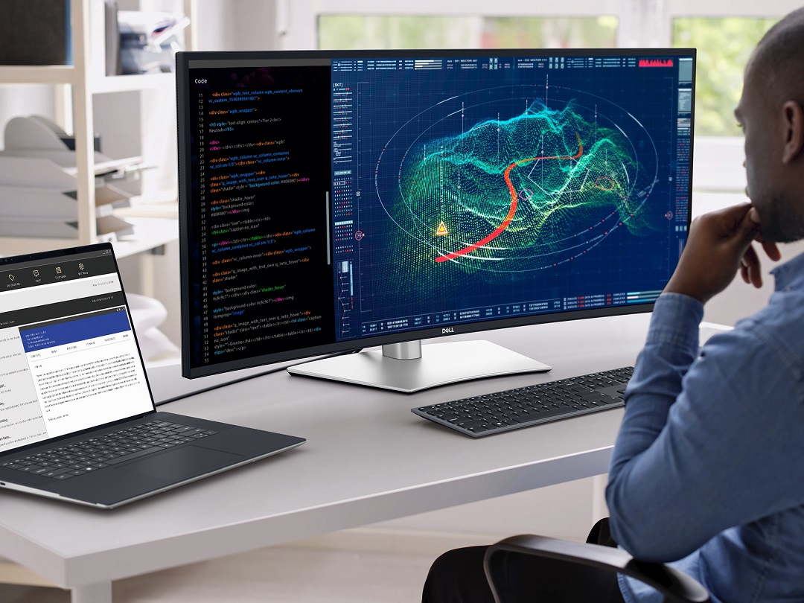{width="414"}

**Computadores Pessoais** (Laptops e Desktops) - Um Computador Pessoal empresarial é um computador de mesa com capacidade dimensionada para uso em empresas e organizações visando tratar tarefas administrativas dos departamentos. O mesmo se aplica aos computadores portáteis empresariais (laptops);

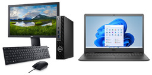

**Dispositivos móveis** (Smartphones e Tablets) - Os smartphones e tablets empresarias são aparelho celular fornecido por uma empresa para que os colaboradores usem no trabalho, normalmente customizados com configurações avançadas, como e-mail corporativo, aplicativos de gestão de projetos e CRM (Sistema de Relacionamento com Clientes) ;

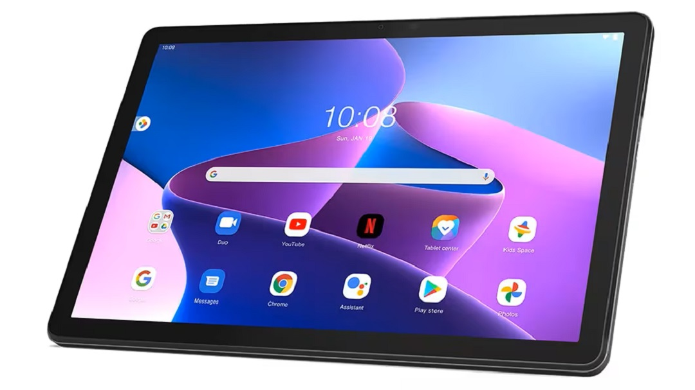

### Redes de Computadores

-   **Roteadores:** Direcionam o tráfego de dados entre redes. Operam em camada de rede OSI "3". Podem ser **roteadores internos** à empresa (Roteadores Internos ao Sistema Autônomo de Roteamento) ou **roteadores de borda** (Roteadores Externos ao Sistema Autônomo de Roteamento).

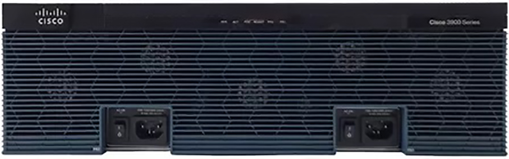

-   **Switches:** Conectam dispositivos dentro de uma rede local da empresa (LAN - Local Area Network). camada de rede OSI "2"

-   **Firewalls:** Protegem a rede contra acessos não autorizados e ameaças externas.

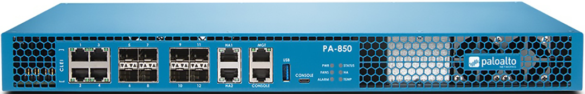

-   **Pontos de Acesso Wi-Fi:** Permitem a conexão sem fio à rede. camada de rede OSI "2"

    Os pontos de acesso de rede sem fio (WI-FI) formam uma grande célula wi-fi na empresa. A célula, tal qual um siwitch virtual, tem apenas a função de conectar os dispositivos, geralmente os dispositivos móveis, a rede local da empresa (LAN - Local Area Network).

[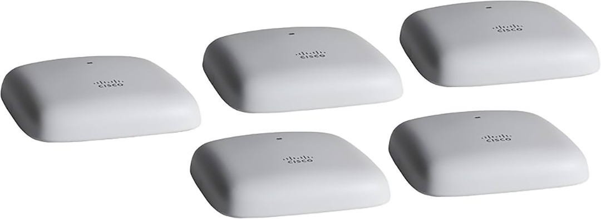](Pontos%20de%20Acesso%20CISCO)

-   **Cabos e Conectores:** A infraestrutura física para conectar os dispositivos. camada de rede OSI "1"

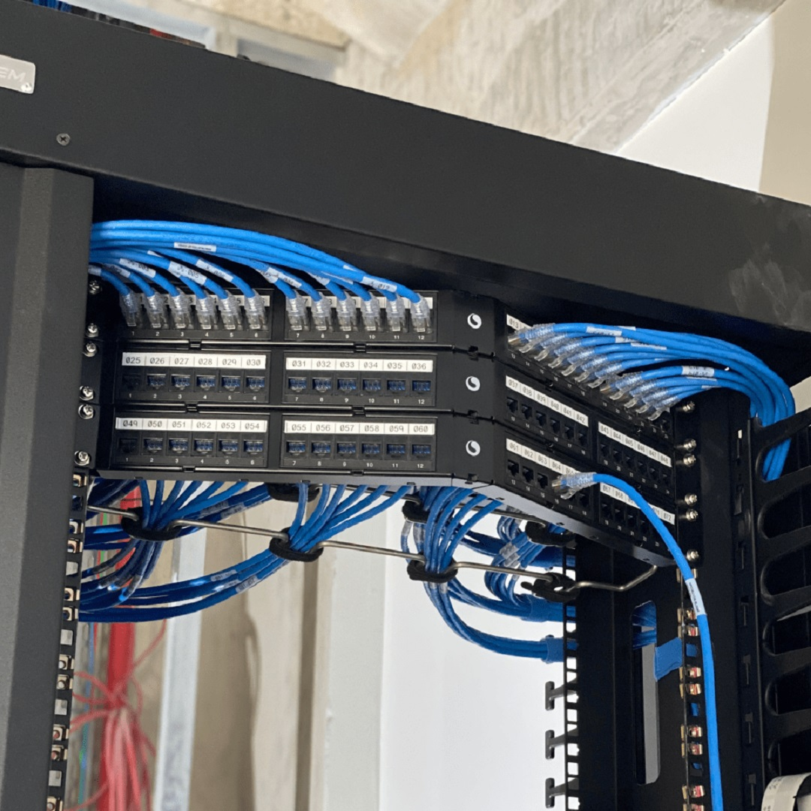{width="436"}

### Software

#### Sistemas Operacionais

+:-----------------------------------------------------------------------------------------------------------------------------------------:+
| 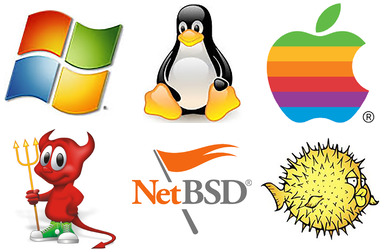                                                      |
+-------------------------------------------------------------------------------------------------------------------------------------------+
| **Sistemas Operacionais** são softwares fundamentais que gerenciam o hardware e os recursos do sistema. Exemplos de Sistemas Operacionais |
|                                                                                                                                           |
| **Microsoft Windows**                                                                                                                     |
|                                                                                                                                           |
| **Distribuições Linux**                                                                                                                   |
|                                                                                                                                           |
| **Apple MacOS**                                                                                                                           |
|                                                                                                                                           |
| **Unix FreeBSD**                                                                                                                          |
|                                                                                                                                           |
| **Unix NetBSD**                                                                                                                           |
|                                                                                                                                           |
| **Unix OpenBSD**                                                                                                                          |
+-------------------------------------------------------------------------------------------------------------------------------------------+

#### Aplicações Empresariais

+:----------------------------------------------------------------------------------:+
| {alt="Softwares ERPs"}                 |
+------------------------------------------------------------------------------------+
| **Aplicações Empresariais** são softwares utilizados para as atividades de negócio |
|                                                                                    |
| (ex: ERP, CRM, sistemas de gestão de RH, sistemas de contabilidade).               |
|                                                                                    |
| **ERP BLING**                                                                      |
|                                                                                    |
| **ERP SAP**                                                                        |
|                                                                                    |
| **ERP TOTVS**                                                                      |
|                                                                                    |
| **ERP LINX**                                                                       |
+------------------------------------------------------------------------------------+

#### Softwares de Produtividade

+:----------------------------------------------------------------------------------------------------------------------------------------------------:+
| 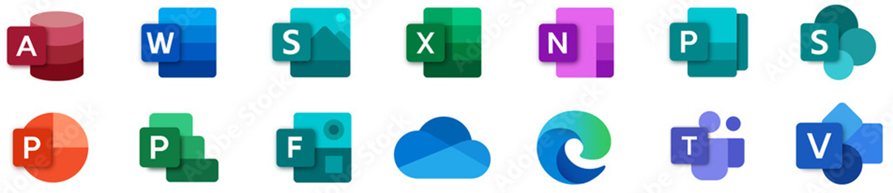                    |
+------------------------------------------------------------------------------------------------------------------------------------------------------+
| **Software de Produtividade** são ferramentas para criação de documentos, planilhas, apresentações, e-mail (ex: Microsoft Office, Google Workspace). |
+------------------------------------------------------------------------------------------------------------------------------------------------------+

#### Softwares de Segurança

+:-----------------------------------------------------------------------------------------------------------------------------------------------------------------------------------------------------------------------:+
| 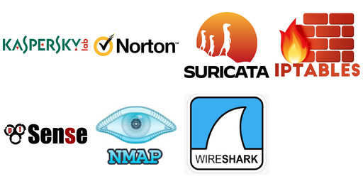                                                                                                                  |
+-------------------------------------------------------------------------------------------------------------------------------------------------------------------------------------------------------------------------+
| **Software de Segurança** é uma categoria de software onde se enquadram os antivírus, anti-malware, sistemas de detecção de intrusão (IDS), sistemas de prevenção de intrusão (IPS). Exemplos de Softwares de Segurança |
|                                                                                                                                                                                                                         |
| **Karspersky (Anti-vírus)**                                                                                                                                                                                             |
|                                                                                                                                                                                                                         |
| **Norton (Anti-vírus)**                                                                                                                                                                                                 |
|                                                                                                                                                                                                                         |
| **Suricata (IDS - detector de Intrusão)**                                                                                                                                                                               |
|                                                                                                                                                                                                                         |
| **IPTables (Firewall nativo do Linux)**                                                                                                                                                                                 |
|                                                                                                                                                                                                                         |
| **PF (Firewall nativo do Unix FreeBSD)**                                                                                                                                                                                |
|                                                                                                                                                                                                                         |
| **NMAP (Mapeador de portas TCP/IP)**                                                                                                                                                                                    |
|                                                                                                                                                                                                                         |
| **Wireshark (Farejador - sniffer - de pacotes de rede)**                                                                                                                                                                |
+-------------------------------------------------------------------------------------------------------------------------------------------------------------------------------------------------------------------------+

#### Softwares de Gerenciamento de Rede

+:------------------------------------------------------------------------------------------------------------------------:+
| 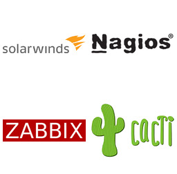                                      |
+--------------------------------------------------------------------------------------------------------------------------+
| **Software de Gerenciamento de Rede** é uma categoria deferramentas para monitorar e gerenciar a infraestrutura de rede. |
+--------------------------------------------------------------------------------------------------------------------------+

#### Sistemas de Gerenciamento de Banco de Dados (SGBDs)

+--------------------------------------------------------------------------------------------------------------------------------------------+
| -   **Bancos de Dados:** Sistemas para armazenar e gerenciar grandes volumes de dados de forma organizada (ex: SQL Server, Oracle, MySQL). |
+--------------------------------------------------------------------------------------------------------------------------------------------+

+---------------------------------------------------+:--------------------:+
| **Paradigma relacional**                          | Postgres             |
|                                                   |                      |
| 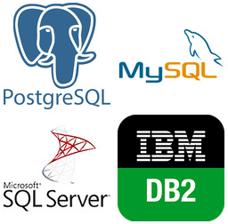{width="208"} | Mysql                |
|                                                   |                      |
|                                                   | Microsoft SQL Server |
|                                                   |                      |
|                                                   | IBM DB2              |
|                                                   |                      |
|                                                   | Oracle               |
+---------------------------------------------------+----------------------+

+--------------------------------------+:------------------:+
| **Paradigma não-relacional**         | Cassandra          |
|                                      |                    |
|  | MongoDB            |
+--------------------------------------+--------------------+

+--------------------------------------+:------------------:+
| **Paradigma Grafo**                  | neo4J              |
|                                      |                    |
|  |                    |
+--------------------------------------+--------------------+

+---------------------------------------------------+:----------------:+
| **Paradigma Hierárquico**                         | Active Directory |
|                                                   |                  |
| {width="348"} | OpenLDAP         |
+---------------------------------------------------+------------------+

#### Middleware: Software que permite a comunicação e a troca de dados entre diferentes aplicações.

+:------------------------:+:-------------------------:+
| **Tipo de MiddleWare**   | **Exemplo de Middleware** |
+--------------------------+---------------------------+
| Filas de Mensagens       | Apache Kafka              |
|                          |                           |
|                          | RabbitMQ                  |
+--------------------------+---------------------------+

+:----------------------------:+:-------------------------:+
| **Tipo de MiddleWare**       | **Exemplo de Middleware** |
+------------------------------+---------------------------+
| Enterprise Service BUS (ESB) | Apache Camel              |
|                              |                           |
|                              | Mulesoft                  |
+------------------------------+---------------------------+

+:------------------------:+:-------------------------:+
| **Tipo de MiddleWare**   | **Exemplo de Middleware** |
+--------------------------+---------------------------+
| APIs Gateways            | KONG                      |
|                          |                           |
|                          | TYK                       |
+--------------------------+---------------------------+

+:----------------------------------:+:-------------------------:+
| **Tipo de MiddleWare**             | **Exemplo de Middleware** |
+------------------------------------+---------------------------+
| Middleware de Banco de Dados (ORM) | Hibernate (java)          |
|                                    |                           |
|                                    | SQLAlchemy (python)       |
|                                    |                           |
|                                    | soci (c++)                |
+------------------------------------+---------------------------+

+:------------------------:+:-------------------------:+
| **Tipo de MiddleWare**   | **Exemplo de Middleware** |
+--------------------------+---------------------------+
| Computação Distribuida   | CORBA                     |
|                          |                           |
|                          | JAVA RMI                  |
+--------------------------+---------------------------+

#### Softwares de Virtualização

+:-------------------------------------------------------------------------------------------------------------------------:+
| **Software de Virtualização:** Permite executar múltiplos sistemas operacionais e aplicações em um único servidor físico. |
|                                                                                                                           |
| 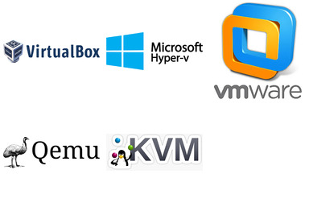                                                                |
+---------------------------------------------------------------------------------------------------------------------------+
| Oracle Virtualbox (gratuito)                                                                                              |
|                                                                                                                           |
| Microsoft Hyper-V                                                                                                         |
|                                                                                                                           |
| VMWARE Wokstation                                                                                                         |
|                                                                                                                           |
| GNU QEMU (emulador)                                                                                                       |
|                                                                                                                           |
| Linux KVM (Módulo do kernel)                                                                                              |
+---------------------------------------------------------------------------------------------------------------------------+

#### Softwares de Backup e Recuperação

+:--------------------------------------------------------------------------------------------------------------------------:+----------------------------------------------+
| **Sistemas de Backup e Recuperação:** Software para automatizar e gerenciar os processos de backup e restauração de dados. | 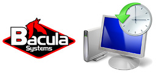 |
+----------------------------------------------------------------------------------------------------------------------------+----------------------------------------------+

### Serviços de TIC

+---------------------------------------------------------+------------------------------------------------------------------------------------------------------------------------------------------------------------------------------------------------------------------------------------------------------------------------------------------+---------------------------------------------------------------------------------------------+
| Tipo de Serviço Corporativo                             | Descrição                                                                                                                                                                                                                                                                                | Softwares servidores do serviço                                                             |
+=========================================================+==========================================================================================================================================================================================================================================================================================+=============================================================================================+
| Correio eletrônico - E-Mail                             | Método de comunicação digital que permite o envio e recebimento de mensagens através da internet;                                                                                                                                                                                        | 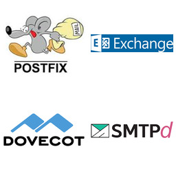                                       |
|                                                         |                                                                                                                                                                                                                                                                                          |                                                                                             |
|                                                         | Softwares que implantam o serviço eletrônico são o **postfix, microsoft exchange, dovecot e o smtpd**;                                                                                                                                                                                   |                                                                                             |
+---------------------------------------------------------+------------------------------------------------------------------------------------------------------------------------------------------------------------------------------------------------------------------------------------------------------------------------------------------+---------------------------------------------------------------------------------------------+
| Compartilhamento de Arquivos                            | Permite aos usuários armazenar, acessar e distribuir arquivos digitais pela internet;                                                                                                                                                                                                    | 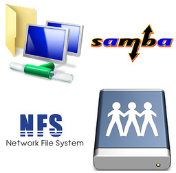 |
|                                                         |                                                                                                                                                                                                                                                                                          |                                                                                             |
|                                                         | Softwares que implantam o serviço eletrônico são o **File Server do Windows, Samba (Linux), NFS (Linux e Unix)**;                                                                                                                                                                        |                                                                                             |
+---------------------------------------------------------+------------------------------------------------------------------------------------------------------------------------------------------------------------------------------------------------------------------------------------------------------------------------------------------+---------------------------------------------------------------------------------------------+
| Compartilhamento de Impressoras                         | Permite que vários computadores em uma rede corporativa utilizem uma única impressora;                                                                                                                                                                                                   | 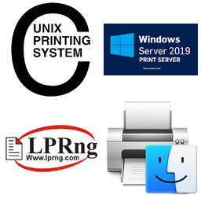                |
|                                                         |                                                                                                                                                                                                                                                                                          |                                                                                             |
|                                                         | Softwares que implantam o serviço de impressão na rede são **CUPS (linux) e o Spool de Impressão do Windows**;                                                                                                                                                                           |                                                                                             |
+---------------------------------------------------------+------------------------------------------------------------------------------------------------------------------------------------------------------------------------------------------------------------------------------------------------------------------------------------------+---------------------------------------------------------------------------------------------+
| Serviço de Nomes de Domínio - DNS                       | É essencialmente a "lista telefônica" da internet. Ele traduz nomes de domínio amigáveis (como "[google.com](https://www.google.com/search?q=google.com)") em endereços IP numéricos (como "172.217.160.142"), que os computadores usam para se comunicar entre si.                      |                      |
|                                                         |                                                                                                                                                                                                                                                                                          |                                                                                             |
|                                                         | Softwares que implantam o serviço de nomes de domínio na rede são **Bind (Linux) e o Active Directory (Windows)**;                                                                                                                                                                       |                                                                                             |
+---------------------------------------------------------+------------------------------------------------------------------------------------------------------------------------------------------------------------------------------------------------------------------------------------------------------------------------------------------+---------------------------------------------------------------------------------------------+
| Gerenciamento de usuários da rede corporativa           | Um serviço de gerenciamento de usuários de rede corporativa, também conhecido como domínio, é um sistema centralizado que permite aos administradores de TI controlar e gerenciar o acesso de usuários e recursos em uma rede corporativa;                                               |                      |
|                                                         |                                                                                                                                                                                                                                                                                          |                                                                                             |
|                                                         | Softwares que implantam o serviço de nomes de domínio na rede são **OpenLdap (Linux) e o Active Directory (Windows)**;                                                                                                                                                                   |                                                                                             |
+---------------------------------------------------------+------------------------------------------------------------------------------------------------------------------------------------------------------------------------------------------------------------------------------------------------------------------------------------------+---------------------------------------------------------------------------------------------+
| Gerenciamento de páginas web e publicações corporativas | Um serviço de publicação de informações e documentos visando a propagação de informações internas e a colaboração entre equipes.                                                                                                                                                         | 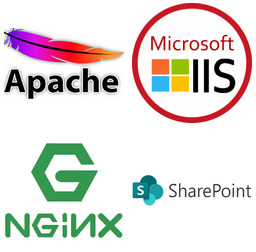                                             |
|                                                         |                                                                                                                                                                                                                                                                                          |                                                                                             |
|                                                         | Softwares que implantam o serviço de páginas web e publicações corporativas são o servidor web **Apache (Linux e Unix),** o servidor web **NGINX (Linux e Unix)**, o **IIS** **(Internet Information Service)** da Microsoft e, mais recentemente, o **seviço Sharepoint** da Microsoft; |                                                                                             |
+---------------------------------------------------------+------------------------------------------------------------------------------------------------------------------------------------------------------------------------------------------------------------------------------------------------------------------------------------------+---------------------------------------------------------------------------------------------+

: Serviços de TIC

## Gestão do Departamento de TIC nas empresas

### ITSM

A Gestão de Serviços de Informática chamada (GSTI) ou, no inglês, ITSM (IT Service Management) tem por objetivo prover um serviço de TI com qualidade e alinhado às necessidades do negócio, buscando redução de custos a longo prazo.

Nos últimos 40 anos, tem-se reunido boas práticas de Gestão de Serviços de Informática chamada ao ponto de criar "bibliotecas", ou seja, coleções de boas práticas. Vejamos as duas mais famosas:

#### ITIL (Information Technology Infrastructure Library)

O ITIL (Information Technology Infrastructure Library) é um conjunto de melhores práticas para o gerenciamento de serviços de Tecnologia da Informação (TI). Ele fornece um framework abrangente e flexível que as organizações podem usar para alinhar seus serviços de TI com as necessidades de seus negócios. O ITIL ajuda as empresas a otimizar seus processos de TI, melhorar a qualidade dos serviços, reduzir custos e aumentar a satisfação do cliente.

Atualmente, a AXELOS é a proprietária do ITIL e responsável por sua evolução e pelas certificações relacionadas.

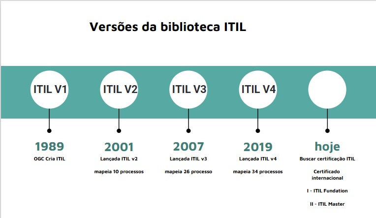

Para dar uma noção sobre melhores práticas de gestão de processos de TIC, utilizaremos o framework ITIL em sua versão 2 (2001), uma vez que o mesmo possui apenas 10 processos de Gestão de TIC divididos em dois grupos chamdos disciplinas ITIL.

##### Processos ITIL Versão 2 (2001)

+-----------------------------------------+--------------------------------------------+
| Grupo de Processos (Disciplina ITIL v2) | Processos                                  |
+:=======================================:+:==========================================:+
| **"GRUPO" SUPORTE A SERVIÇO**           | 01- Gestão de Incidentes                   |
|                                         |                                            |
|                                         | 02- Gestão de Problemas                    |
|                                         |                                            |
|                                         | 03- Gestão de Mudanças                     |
|                                         |                                            |
|                                         | 04- Gestão de Liberação                    |
|                                         |                                            |
|                                         | 05- Gestão Configuração                    |
+-----------------------------------------+--------------------------------------------+
| **"GRUPO" ENTREGA DE SERVIÇO**          | 06- Gestão de Nível de Serviço             |
|                                         |                                            |
|                                         | 07- Gestão de Disponibilidade              |
|                                         |                                            |
|                                         | 08- Gestão de Capacidade                   |
|                                         |                                            |
|                                         | 09- Gestão de Continuidade de Serviços TIC |
|                                         |                                            |
|                                         | 10- Gestão Financeira para Serviços de TIC |
+-----------------------------------------+--------------------------------------------+

##### Processos do grupo SUPORTE A SERVIÇOS DE TIC

O ITIL descreve melhores práticas para gestão de serviços de TIC. A Disciplina (agrupamento) de Suporte ao Serviço e a Disciplina (agrupamento) de Fornecimento de serviço combinadas oferecem o recurso de **Gerenciamento de Serviço de TIC** a uma organização. Inter-relacionamentos complexos entre todas as dez disciplinas do Gerenciamento de Serviços interagem para garantir que a infraestrutura de TI forneça um alto nível de serviço aos negócios.

###### 01- Gestão de Incidentes

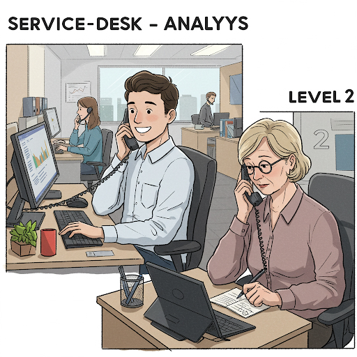

O processo "**Service Desk e Gerenciamento de Incidentes**" visa restaurar os Serviços de TI para seus Níveis de Serviço definidos o mais rápido possível O processo também é responsável por receber e processar Solicitações de Serviço, por auxiliar os usuários e por coordenar a Resolução de Incidentes com Grupos de Suporte Especializados. Ao longo do processo, os usuários são informados em intervalos regulares sobre o status de seus incidentes.

###### 02- Gestão de Problemas

O objetivo do **Processo de Gerenciamento de Problemas** é resolver a causa raiz dos Incidentes e evitar a recorrência de Incidentes relacionados a esses erros. Ele fornece Gerenciamento de Incidentes com Correções Temporárias (Soluções) e Soluções Permanentes para Erros Conhecidos. O Gerenciamento Proativo de Problemas identifica e resolve Problemas antes que os Incidentes ocorram, por exemplo, analisando tendências no Uso de Serviços de TI ou investigando Incidentes históricos.

###### 03- Gestão de Mudanças

No **Processo de Gerenciamento de Mudanças**, todas as alterações na infraestrutura de TI e seus componentes (Itens de Configuração) são autorizadas e documentadas, a fim de garantir que os efeitos de interrupção na operação em execução sejam reduzidos ao mínimo. As etapas de implementação são planejadas e comunicadas, a fim de reconhecer possíveis efeitos colaterais o mais cedo possível. O Gerente de Mudanças e (para Mudanças de maior alcance) o Conselho Consultivo de Mudanças (CAB) são responsáveis por isso. Existe um procedimento específico para emergências, lidando com Mudanças Urgentes.

###### 04- Gestão de Liberação

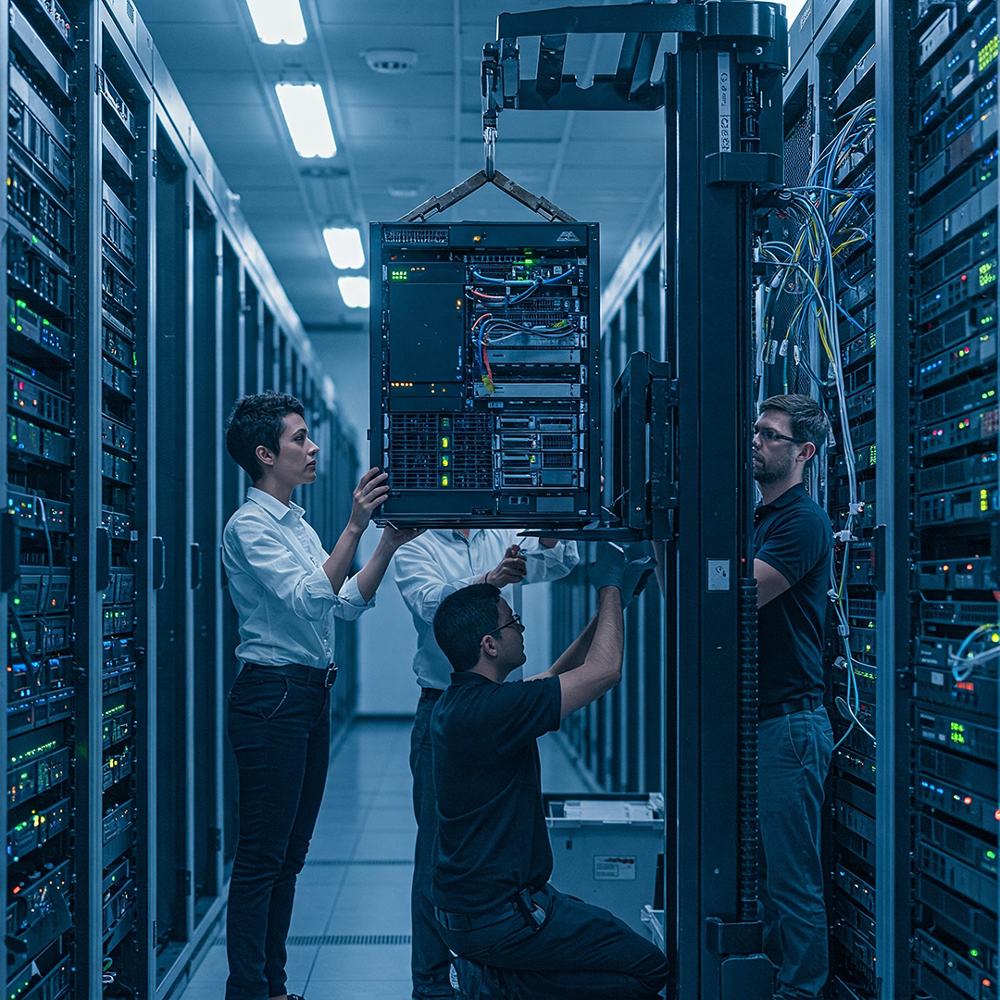

O **Processo de Liberação de Mudanças** é responsável pela implementação de mudanças aprovadas na Infraestrutura de TI, para que estas sejam realizadas de forma eficaz, segura e verificável. As tarefas deste processo incluem planejamento, monitoramento e implementação dos respectivos *Rollouts* ou *Rollins* em coordenação com o Gerenciamento de Mudanças anteriormente citada.

###### 05- Gestão Configuração

As informações sobre Infraestrutura e Serviços necessárias para o Gerenciamento de Serviços de TI são disponibilizadas pelo Gerenciamento de Configuração. As alterações são documentadas e o status atualizado das informações é verificado regularmente. Com isso, informações atualizadas e históricas sobre os Itens de Configuração (CIs) estão continuamente disponíveis no Banco de Dados de Gerenciamento de Configuração (CMDB).

##### Processos do grupo ENTREGA DE SERVIÇOS DE TIC

###### 06- Gestão de Nível de Serviço

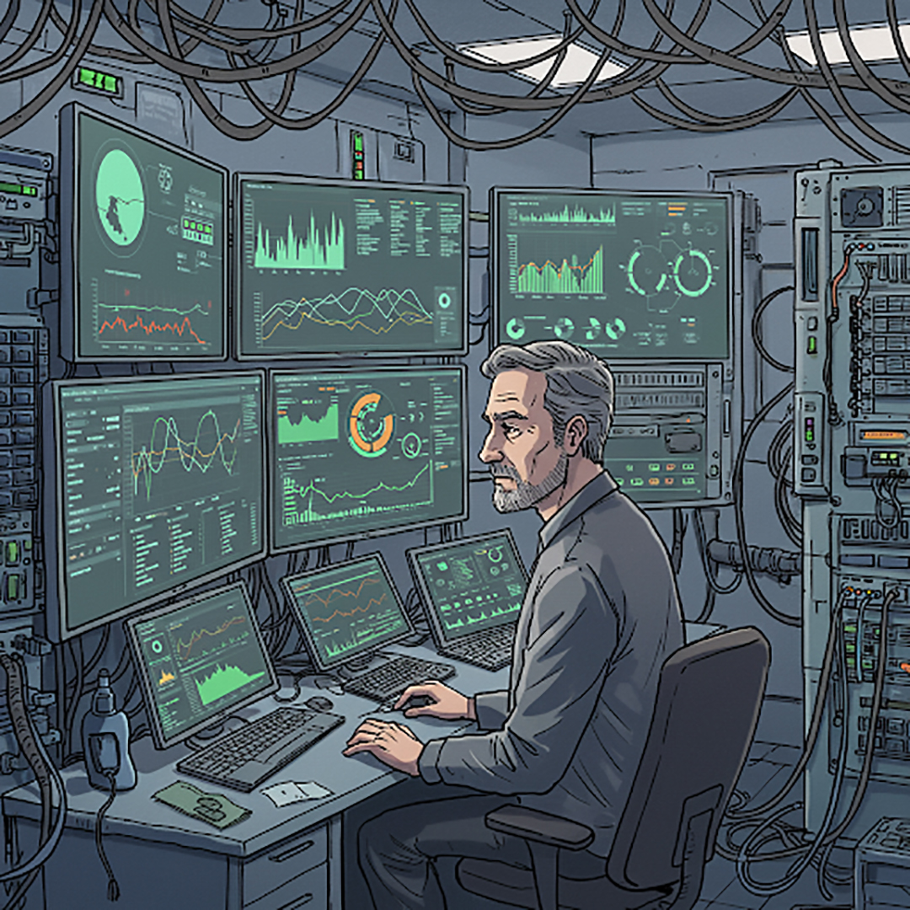{width="385"}

O Gerenciamento de Nível de Serviço tem as tarefas de manter o Catálogo de Serviços da Organização de TI e alcançar acordos vinculativos para Desempenho de Serviços internos e externos. Na interface com o cliente, os Contratos de Nível de Serviço são acordados. O Gerente de Nível de Serviço é responsável pelo monitoramento dos parâmetros de qualidade acordados e, quando necessário, recorre a contramedidas. A prestação adequada de Serviços de TI internos é assegurada através de Acordos de Nível Operacional e Contratos de Apoio (OLAs/UCs).

###### 07- Gestão de Disponibilidade

O Gerenciamento de Disponibilidade permite que as Organizações de TI sustentem a disponibilidade da infraestrutura de TI para atender aos Níveis de Serviço acordados definidos nos SLAs. Ele monitora constantemente os níveis de disponibilidade alcançados e, quando necessário, realiza medidas corretivas.

###### 08- Gestão de Capacidade

O Gerenciamento de Capacidade suporta a provisão ideal e econômica de Serviços de TI, ajudando as Organizações de TI a combinar seus Recursos de TI (Software, Hardware, Recursos Humanos) com as necessidades de negócios. O processo envolve estimativas de demanda futura, que são a base para o planejamento de necessidades futuras de capacidade, resultando no Plano de Capacidade.

###### 09- Gestão de Continuidade de Serviços TIC

O Gerenciamento de Continuidade de Serviço de TI define e planeja todas as medidas e processos para eventos imprevistos de desastre. A análise regular de vulnerabilidades, ameaças e riscos representa uma base para precauções adequadas.

###### 10- Gestão Financeira para Serviços de TI

O Gerenciamento Financeiro para Serviços de TI garante o uso mais econômico dos recursos financeiros de TI e cobra dos clientes pela prestação de Serviços de TI. Durante este período, deve ser alcançada uma relação equilibrada entre qualidade e custos, tendo simultaneamente em conta os requisitos do cliente. A realização do planeamento orçamental regular e o apuramento dos meios financeiros aprovados é também uma das tarefas da Gestão Financeira.

## Exercícios de Fixação

### Testes de múltipla escolha

+------------------------------------------------------------------------------------------------------------------------------------------------------------+
| **TESTE 01**                                                                                                                                               |
+:===========================================================================================================================================================+
| O que serve como base para todos os sistemas de informação em uma empresa, fornecendo o fundamento sobre o qual as operações de TIC podem ser construídas? |
+------------------------------------------------------------------------------------------------------------------------------------------------------------+
| A)  Aplicações de software                                                                                                                                 |
+------------------------------------------------------------------------------------------------------------------------------------------------------------+
| B)  Tecnologia de gestão de dados                                                                                                                          |
+------------------------------------------------------------------------------------------------------------------------------------------------------------+
| C)  Infraestrutura de Tecnologia da Informação e Comunicação (TIC)                                                                                         |
+------------------------------------------------------------------------------------------------------------------------------------------------------------+
| D)  Processos de negócio                                                                                                                                   |
+------------------------------------------------------------------------------------------------------------------------------------------------------------+
| E)  Interfaces de usuário                                                                                                                                  |
+------------------------------------------------------------------------------------------------------------------------------------------------------------+

+----------------------------------------------------------------------------------------------------------------------------------------------------------------------+
| **TESTE 02**                                                                                                                                                         |
+:=====================================================================================================================================================================+
| De acordo com as fontes que referenciam o livro de Laudon, qual das seguintes alternativas é considerada um dos cinco elementos principais da infraestrutura de TI ? |
+----------------------------------------------------------------------------------------------------------------------------------------------------------------------+
| A)  Relacionamento com clientes                                                                                                                                      |
+----------------------------------------------------------------------------------------------------------------------------------------------------------------------+
| B)  Estratégias de marketing                                                                                                                                         |
+----------------------------------------------------------------------------------------------------------------------------------------------------------------------+
| C)  Cultura organizacional                                                                                                                                           |
+----------------------------------------------------------------------------------------------------------------------------------------------------------------------+
| D)  Serviços de tecnologia                                                                                                                                           |
+----------------------------------------------------------------------------------------------------------------------------------------------------------------------+
| E)  Relatórios financeiros                                                                                                                                           |
+----------------------------------------------------------------------------------------------------------------------------------------------------------------------+

+--------------------------------------------------------------------------------------------------------------+
| **TESTE 03**                                                                                                 |
+:=============================================================================================================+
| Dentro da Gestão do Departamento de TIC, o Processo de Gestão de Liberação é responsável por qual atividade? |
+--------------------------------------------------------------------------------------------------------------+
| A)  Planejar futuras necessidades de capacidade                                                              |
+--------------------------------------------------------------------------------------------------------------+
| B)  Sustentar a disponibilidade da infraestrutura                                                            |
+--------------------------------------------------------------------------------------------------------------+
| C)  Implementar mudanças aprovadas na infraestrutura de TI de forma eficaz, segura e verificável.            |
+--------------------------------------------------------------------------------------------------------------+
| D)  Organizar os dados da empresa                                                                            |
+--------------------------------------------------------------------------------------------------------------+
| E)  Desenvolver aplicações de software                                                                       |
+--------------------------------------------------------------------------------------------------------------+

+------------------------------------------------------------------------------------------------------------------------------------------------------------------------+
| **TESTE 04**                                                                                                                                                           |
+:=======================================================================================================================================================================+
| O processo que permite às Organizações de TI sustentar a disponibilidade da infraestrutura de TI para atender aos Níveis de Serviço acordados (SLAs) é conhecido como: |
+------------------------------------------------------------------------------------------------------------------------------------------------------------------------+
| A)  Gestão de Capacidade                                                                                                                                               |
+------------------------------------------------------------------------------------------------------------------------------------------------------------------------+
| B)  Gestão de Configuração                                                                                                                                             |
+------------------------------------------------------------------------------------------------------------------------------------------------------------------------+
| C)  Gestão de Problemas                                                                                                                                                |
+------------------------------------------------------------------------------------------------------------------------------------------------------------------------+
| D)  Gestão de Incidentes                                                                                                                                               |
+------------------------------------------------------------------------------------------------------------------------------------------------------------------------+
| E)  Gestão de Disponibilidade                                                                                                                                          |
+------------------------------------------------------------------------------------------------------------------------------------------------------------------------+

+-------------------------------------------------------------------------------------------------------------------------------------------------------------------------------------------------------------+
| **TESTE 05**                                                                                                                                                                                                |
+:============================================================================================================================================================================================================+
| Qual processo suporta a provisão ideal e econômica de Serviços de TI, ajudando as Organizações de TI a combinar seus Recursos de TI (Software, Hardware, Recursos Humanos) com as necessidades de negócios? |
+-------------------------------------------------------------------------------------------------------------------------------------------------------------------------------------------------------------+
| A)  Gestão de Liberação                                                                                                                                                                                     |
+-------------------------------------------------------------------------------------------------------------------------------------------------------------------------------------------------------------+
| B)  Gestão de Nível de Serviço                                                                                                                                                                              |
+-------------------------------------------------------------------------------------------------------------------------------------------------------------------------------------------------------------+
| C)  Gestão Financeira                                                                                                                                                                                       |
+-------------------------------------------------------------------------------------------------------------------------------------------------------------------------------------------------------------+
| D)  Gestão de Capacidade                                                                                                                                                                                    |
+-------------------------------------------------------------------------------------------------------------------------------------------------------------------------------------------------------------+
| E)  Gestão de Continuidade de Negócio                                                                                                                                                                       |
+-------------------------------------------------------------------------------------------------------------------------------------------------------------------------------------------------------------+

+--------------------------------------------------------------------------------------------------------------------------------------------------------------------------------------------------------------------------------------------------------------------------------------------------------------------------------------------------------------------------------------------------------------------------+
| **TESTE 06**                                                                                                                                                                                                                                                                                                                                                                                                             |
+:=========================================================================================================================================================================================================================================================================================================================================================================================================================+
| A Biblioteca ITIL em sua Versão 2 (2001) propõe na totalidade os seguintes processos de gestão de TIC para as organizações:                                                                                                                                                                                                                                                                                              |
+--------------------------------------------------------------------------------------------------------------------------------------------------------------------------------------------------------------------------------------------------------------------------------------------------------------------------------------------------------------------------------------------------------------------------+
| A)  05 processos conhecidos como grupo de processos de suporte a serviço: Gestão de Incidentes, Gestão de Problemas, Gestão de Mudanças, Gestão de Liberação e Gestão Configuração.                                                                                                                                                                                                                                      |
+--------------------------------------------------------------------------------------------------------------------------------------------------------------------------------------------------------------------------------------------------------------------------------------------------------------------------------------------------------------------------------------------------------------------------+
| B)  05 processos conhecidos como grupo de processos de entrega de serviço: Gestão de Incidentes, Gestão de Problemas, Gestão de Mudanças, Gestão de Liberação e Gestão Configuração.                                                                                                                                                                                                                                     |
+--------------------------------------------------------------------------------------------------------------------------------------------------------------------------------------------------------------------------------------------------------------------------------------------------------------------------------------------------------------------------------------------------------------------------+
| C)  10 processos conhecidos como grupo de processos de suporte a serviço: Gestão de Incidentes, Gestão de Problemas, Gestão de Mudanças, Gestão de Liberação, Gestão Configuração, Gestão de Nível de Serviço, Gestão de Disponibilidade, Gestão de Capacidade, Gestão de Continuidade de Serviços TIC e Gestão Financeira para Serviços de TIC                                                                          |
+--------------------------------------------------------------------------------------------------------------------------------------------------------------------------------------------------------------------------------------------------------------------------------------------------------------------------------------------------------------------------------------------------------------------------+
| D)  05 processos conhecidos como grupo de processos de suporte a serviço: Gestão de Incidentes, Gestão de Problemas, Gestão de Mudanças, Gestão de Liberação, Gestão Configuração; e 05 processos conhecidos como grupo de processos de entrega de serviço: Gestão de Nível de Serviço, Gestão de Disponibilidade, Gestão de Capacidade, Gestão de Continuidade de Serviços TIC e Gestão Financeira para Serviços de TIC |
+--------------------------------------------------------------------------------------------------------------------------------------------------------------------------------------------------------------------------------------------------------------------------------------------------------------------------------------------------------------------------------------------------------------------------+
| E)  Nenhuma das anteriores.                                                                                                                                                                                                                                                                                                                                                                                              |
+--------------------------------------------------------------------------------------------------------------------------------------------------------------------------------------------------------------------------------------------------------------------------------------------------------------------------------------------------------------------------------------------------------------------------+

+-----------------------------------------------------------------------------------------------------------------------------------------------------------------------------------------------------------------------+
| **TESTE 07**                                                                                                                                                                                                          |
+:======================================================================================================================================================================================================================+
| De acordo com as fontes, a distinção entre Governança de TIC e Gestão de TIC, baseada no COBIT 5, é que:                                                                                                              |
+-----------------------------------------------------------------------------------------------------------------------------------------------------------------------------------------------------------------------+
| A)  Governança assegura que a TI apoie eficazmente os objetivos e estratégias da organização, gerencie riscos e otimize recursos, enquanto Gestão é responsável pela execução da orientação definida pela Governança. |
+-----------------------------------------------------------------------------------------------------------------------------------------------------------------------------------------------------------------------+
| B)  Governança é responsável pela execução da orientação, enquanto Gestão assegura que a TI apoie objetivos e estratégias organizacionais.                                                                            |
+-----------------------------------------------------------------------------------------------------------------------------------------------------------------------------------------------------------------------+
| C)  Governança foca nas operações diárias, enquanto Gestão foca no alinhamento estratégico.                                                                                                                           |
+-----------------------------------------------------------------------------------------------------------------------------------------------------------------------------------------------------------------------+
| D)  Governança lida com detalhes técnicos, enquanto Gestão lida com suporte ao usuário.                                                                                                                               |
+-----------------------------------------------------------------------------------------------------------------------------------------------------------------------------------------------------------------------+
| E)  Governança é apenas para grandes empresas, enquanto Gestão é para empresas menores.                                                                                                                               |
+-----------------------------------------------------------------------------------------------------------------------------------------------------------------------------------------------------------------------+

+-----------------------------------------------------------------------------------------------------------------------+
| **TESTE 08**                                                                                                          |
+=======================================================================================================================+
| A tecnologia de rede e telecomunicações, como um componente da infraestrutura de TI, é primariamente responsável por: |
+-----------------------------------------------------------------------------------------------------------------------+
| A)  Organizar e processar os dados da organização.                                                                    |
+-----------------------------------------------------------------------------------------------------------------------+
| B)  Administrar os recursos e atividades do computador.                                                               |
+-----------------------------------------------------------------------------------------------------------------------+
| C)  Gerenciar as instalações físicas de TI.                                                                           |
+-----------------------------------------------------------------------------------------------------------------------+
| D)  Desenvolver novas aplicações de software.                                                                         |
+-----------------------------------------------------------------------------------------------------------------------+
| E)  Fornecer a conectividade necessária para interligar computadores e outros dispositivos.                           |
+-----------------------------------------------------------------------------------------------------------------------+

+----------------------------------------------------------------------------------------------------------------------------------------------------------------+
| **TESTE 09**                                                                                                                                                   |
+================================================================================================================================================================+
| Qual das seguintes alternativas melhor descreve o propósito geral da Infraestrutura de TI no contexto empresarial, conforme abordado nas fontes?               |
+----------------------------------------------------------------------------------------------------------------------------------------------------------------+
| A)  Gerar relatórios detalhados para a gerência sênior.                                                                                                        |
+----------------------------------------------------------------------------------------------------------------------------------------------------------------+
| B)  Prover a base de hardware, software, gestão de dados, redes e serviços necessária para que os sistemas de informação suportem as operações da organização. |
+----------------------------------------------------------------------------------------------------------------------------------------------------------------+
| C)  Gerenciar exclusivamente os relacionamentos com fornecedores externos.                                                                                     |
+----------------------------------------------------------------------------------------------------------------------------------------------------------------+
| D)  Focar-se unicamente no desenvolvimento de novas tecnologias inovadoras.                                                                                    |
+----------------------------------------------------------------------------------------------------------------------------------------------------------------+
| E)  Reduzir o número de funcionários necessários de TI.                                                                                                        |
+----------------------------------------------------------------------------------------------------------------------------------------------------------------+

+----------------------------------------------------------------------------------------------------------------+
| **TESTE 10**                                                                                                   |
+================================================================================================================+
| Qual componente da infraestrutura de TI envolve o software para organizar e processar os dados da organização? |
+----------------------------------------------------------------------------------------------------------------+
| A)  Hardware                                                                                                   |
+----------------------------------------------------------------------------------------------------------------+
| B)  Software                                                                                                   |
+----------------------------------------------------------------------------------------------------------------+
| C)  Tecnologia de rede e telecomunicações                                                                      |
+----------------------------------------------------------------------------------------------------------------+
| D)  Tecnologia de gestão de dados                                                                              |
+----------------------------------------------------------------------------------------------------------------+
| E)  Serviços de tecnologia                                                                                     |
+----------------------------------------------------------------------------------------------------------------+

### Resposta dos testes de multipla escolha

+---------------+------------------+
| Alternativa   | Resposta correta |
+:=============:+:================:+
| **01**        | C                |
+---------------+------------------+
| **02**        | D                |
+---------------+------------------+
| **03**        | C                |
+---------------+------------------+
| **04**        | E                |
+---------------+------------------+
| **05**        | D                |
+---------------+------------------+
| **06**        | D                |
+---------------+------------------+
| **07**        | A                |
+---------------+------------------+
| **08**        | E                |
+---------------+------------------+
| **09**        | B                |
+---------------+------------------+
| **10**        | D                |
+---------------+------------------+

### Hardware - Inventário

**Exercício 1 -** Você precisa levantar o montante de capital para comprar equipamentos que vão informatizar a empresa com o seguinte layout.

A empresa tem 9 departamentos: Presidência com 3 funcionários, diretoria com 9 funcionários, departamento de TI 5 funcionários, departamento jurídico com 1 funcionário ,departamento de contabilidade com 5 funcionários, departamento de Recursos Humanos 3 funcionários, Departamento de Vendas 10 funcionários, Departamento de compras com 5 funcionários, Loja física com 10 funcionários e departamento de recursos materiais 5 funcionários. Com exceção dos funcionários da loja física, todos os funcionários usam um computador de mesa, uma mesa, um monitor 21 polegadas, uma cadeira e 1 telefone IP.

Baseado nestas informações, monte a distribuição de funcionários e equipamentos:

+---------------------------------+--------------+--------------------+--------+--------------+----------+-------------+
| Departamento                    | Funcionários | ComputadoresdeMesa | Mesas  | Monitores21" | Cadeiras | TelefonesIP |
+=================================+==============+====================+========+==============+==========+=============+
| Presidência                     | 3            | 3                  | 3      | 3            | 3        | 3           |
+---------------------------------+--------------+--------------------+--------+--------------+----------+-------------+
| Diretoria                       | 9            | 9                  | 9      | 9            | 9        | 9           |
+---------------------------------+--------------+--------------------+--------+--------------+----------+-------------+
| DepartamentodeTI                | 5            | 5                  | 5      | 5            | 5        | 5           |
+---------------------------------+--------------+--------------------+--------+--------------+----------+-------------+
| DepartamentoJurídico            | 1            | 1                  | 1      | 1            | 1        | 1           |
+---------------------------------+--------------+--------------------+--------+--------------+----------+-------------+
| DepartamentodeContabilidade     | 5            | 5                  | 5      | 5            | 5        | 5           |
+---------------------------------+--------------+--------------------+--------+--------------+----------+-------------+
| DepartamentodeRH                | 3            | 3                  | 3      | 3            | 3        | 3           |
+---------------------------------+--------------+--------------------+--------+--------------+----------+-------------+
| DepartamentodeVendas            | 10           | 10                 | 10     | 10           | 10       | 10          |
+---------------------------------+--------------+--------------------+--------+--------------+----------+-------------+
| DepartamentodeCompras           | 5            | 5                  | 5      | 5            | 5        | 5           |
+---------------------------------+--------------+--------------------+--------+--------------+----------+-------------+
| LojaFísica                      | 10           | 0                  | 0      | 0            | 0        | 0           |
+---------------------------------+--------------+--------------------+--------+--------------+----------+-------------+
| DepartamentodeRecursosMateriais | 5            | 5                  | 5      | 5            | 5        | 5           |
+---------------------------------+--------------+--------------------+--------+--------------+----------+-------------+
| Total                           | 56           | 51                 | 51     | 51           | 51       | 51          |
+---------------------------------+--------------+--------------------+--------+--------------+----------+-------------+

: Tabela 1 - Funcionários e equipamentos por departamento

Os equipamentos serão adquiridos em leilão. O melhor preço encontrado para cada item foi o seguinte:

1.  Computador de mesa : R\$ 4.289,00

2.  Monitores 21’ : R\$ 422,92

3.  Mesas : R\$ 195,00

4.  Cadeiras : R\$ 24,51

5.  Telefones IP : R\$ 589,34

Calcule:

a)  Qual o INVESTIMENTO de cada departamento com cada equipamento ?

b)  Qual o INVESTIMENTO da empresa com cada classe de equipamento ?

+---------------------------------+----------------+---------------+--------------+--------------+---------------+
| Departamento                    | Computadores   | Monitores     | Mesas        | Cadeiras     | TelefonesIP   |
+=================================+================+===============+==============+==============+===============+
| Presidência                     | R\$ 12.867,00  | R\$ 1.268,76  | R\$ 585,00   | R\$ 73,53    | R\$ 1.768,02  |
+---------------------------------+----------------+---------------+--------------+--------------+---------------+
| Diretoria                       | R\$ 38.601,00  | R\$ 3.806,28  | R\$ 1.755,00 | R\$ 220,59   | R\$ 5.304,06  |
+---------------------------------+----------------+---------------+--------------+--------------+---------------+
| DepartamentodeTI                | R\$ 21.445,00  | R\$ 2.114,60  | R\$ 975,00   | R\$ 122,55   | R\$ 2.946,70  |
+---------------------------------+----------------+---------------+--------------+--------------+---------------+
| DepartamentoJurídico            | R\$ 4.289,00   | R\$ 422,92    | R\$ 195,00   | R\$ 24,51    | R\$ 589,34    |
+---------------------------------+----------------+---------------+--------------+--------------+---------------+
| DepartamentodeContabilidade     | R\$ 21.445,00  | R\$ 2.114,60  | R\$ 975,00   | R\$ 122,55   | R\$ 2.946,70  |
+---------------------------------+----------------+---------------+--------------+--------------+---------------+
| DepartamentodeRH                | R\$ 12.867,00  | R\$ 1.268,76  | R\$ 585,00   | R\$ 73,53    | R\$ 1.768,02  |
+---------------------------------+----------------+---------------+--------------+--------------+---------------+
| DepartamentodeVendas            | R\$ 42.890,00  | R\$ 4.229,20  | R\$ 1.950,00 | R\$ 245,10   | R\$ 5.893,40  |
+---------------------------------+----------------+---------------+--------------+--------------+---------------+
| DepartamentodeCompras           | R\$ 21.445,00  | R\$ 2.114,60  | R\$ 975,00   | R\$ 122,55   | R\$ 2.946,70  |
+---------------------------------+----------------+---------------+--------------+--------------+---------------+
| LojaFísica                      | R\$ 0,00       | R\$ 0,00      | R\$ 0,00     | R\$ 0,00     | R\$ 0,00      |
+---------------------------------+----------------+---------------+--------------+--------------+---------------+
| DepartamentodeRecursosMateriais | R\$ 21.445,00  | R\$ 2.114,60  | R\$ 975,00   | R\$ 122,55   | R\$ 2.946,70  |
+---------------------------------+----------------+---------------+--------------+--------------+---------------+
| TotalGeral                      | R\$ 218.739,00 | R\$ 21.146,00 | R\$ 9.750,00 | R\$ 1.225,50 | R\$ 29.467,00 |
+---------------------------------+----------------+---------------+--------------+--------------+---------------+

b)  Qual o INVESTIMENTO de cada departamento com TIC ?

c)  Qual o INVESTIMENTO necessário em TIC para informatizar a empresa ?

+------------------------------------+--------------------------------------+-----------------------------------+
| Departamento                       | Custo total TIC Por departamento R\$ | Custo total de TIC da empresa R\$ |
+====================================+======================================+===================================+
| Presidência                        | R\$ 16.562,31                        | R\$ 280.328,50                    |
+------------------------------------+--------------------------------------+-----------------------------------+
| Diretoria                          | R\$ 49.686,93                        |                                   |
+------------------------------------+--------------------------------------+-----------------------------------+
| Departamentode TI                  | R\$ 27.603,85                        |                                   |
+------------------------------------+--------------------------------------+-----------------------------------+
| Departamento Jurídico              | R\$ 5.520,77                         |                                   |
+------------------------------------+--------------------------------------+-----------------------------------+
| Departamentode Contabilidade       | R\$ 27.603,85                        |                                   |
+------------------------------------+--------------------------------------+-----------------------------------+
| Departamentode RH                  | R\$ 16.562,31                        |                                   |
+------------------------------------+--------------------------------------+-----------------------------------+
| Departamentode Vendas              | R\$ 55.207,70                        |                                   |
+------------------------------------+--------------------------------------+-----------------------------------+
| Departamentode Compras             | R\$ 27.603,85                        |                                   |
+------------------------------------+--------------------------------------+-----------------------------------+
| Loja Física                        | R\$ 0,00                             |                                   |
+------------------------------------+--------------------------------------+-----------------------------------+
| Departamento de Recursos Materiais | R\$ 27.603,85                        |                                   |
+------------------------------------+--------------------------------------+-----------------------------------+

## REFERÊNCIAS BIBLIOGRÁFICAS

FUNDAMENTOS EM GERENCIAMENTO DE SERVIÇOS EM TI BASEADO NO ITIL - Flavio Pinheiro - 2006

ITIL V2 SERVICE SUPPORT - PROCESSMAP - acessado em <https://wiki.en.it-processmaps.com/index.php/Service_Support>

ITIL V2 SERVICE DELIVERY - PROCESSMAP - acessado em <https://wiki.en.it-processmaps.com/index.php/Service_Delivery>

**"Sistemas de Informação Gerenciais"** de Kenneth C. Laudon e Jane P. Laudon, 11ª edição - PÁG 35 a 71
