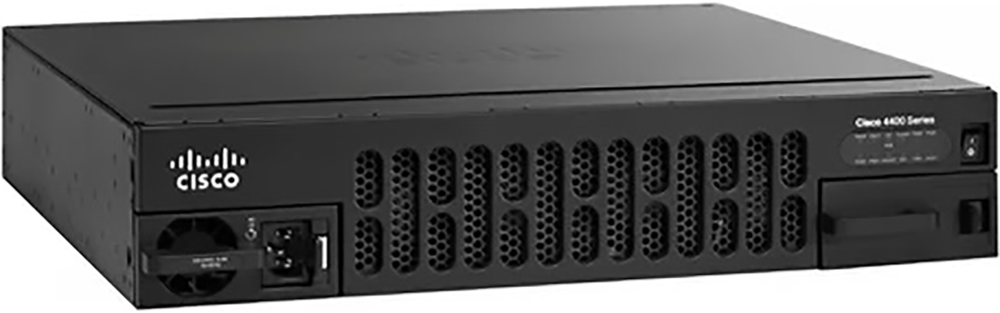

# INFRAESTRUTURA DE TIC

## Introdução:

## Componentes da Infraestrutura de TIC

Em uma empresa, a infraestrutura de TIC precisa de 3 elemntso fundamentais para funcionar:

-   Hardware;

-   Software;

-   Rede;

-   (Bancos de) Dados;

-   Pessoas especializadas;

### Hardware

Fazem parte do cabedal de hadware das empresas:

**Estações de Trabalho** (WorkStations) - É um computador direcionado a atividades profissionais que, frequentemente, demandam bastante desempenho no processamento de dados;

**Computadores Pessoais** (Laptops e Desktops) - Um Computador Pessoal empresarial é um computador de mesa com capacidade dimensionada para uso em empresas e organizações visando tratar tarefas administrativas dos departamentos. O mesmo se aplica aos computadores portáteis empresariais (laptops);

**Dispositivos móveis** (Smartphones e Tablets) - Os smartphones e tablets empresarias são aparelho celular fornecido por uma empresa para que os colaboradores usem no trabalho, normalmente customizados com configurações avançadas, como e-mail corporativo, aplicativos de gestão de projetos e CRM (Sistema de Relacionamento com Clientes) ;

### Redes de Computadores

-   **Roteadores:** Direcionam o tráfego de dados entre redes. Operam em camada de rede OSI "3". Podem ser **roteadores internos** à empresa (Roteadores Internos ao Sistema Autônomo de Roteamento) ou **roteadores de borda** (Roteadores Externos ao Sistema Autônomo de Roteamento).

-   **Switches:** Conectam dispositivos dentro de uma rede local da empresa (LAN - Local Area Network). camada de rede OSI "2"

-   **Firewalls:** Protegem a rede contra acessos não autorizados e ameaças externas.

-   **Pontos de Acesso Wi-Fi:** Permitem a conexão sem fio à rede. camada de rede OSI "2"

    Os pontos de acesso de rede sem fio (WI-FI) formam uma grande célula wi-fi na empresa. A célula, tal qual um siwitch virtual, tem apenas a função de conectar os dispositivos, geralmente os dispositivos móveis, a rede local da empresa (LAN - Local Area Network).

-   **Cabos e Conectores:** A infraestrutura física para conectar os dispositivos. camada de rede OSI "1"

### Software

-   **Sistemas Operacionais:** Software fundamental que gerencia o hardware e os recursos do sistema (ex: Windows Server, Linux, macOS, Windows).

-   **Aplicações Empresariais:** Softwares utilizados para as atividades de negócio (ex: ERP, CRM, sistemas de gestão de RH, sistemas de contabilidade).

-   **Software de Produtividade:** Ferramentas para criação de documentos, planilhas, apresentações, e-mail (ex: Microsoft Office, Google Workspace).

-   **Software de Segurança:** Antivírus, anti-malware, sistemas de detecção de intrusão (IDS), sistemas de prevenção de intrusão (IPS).

-   **Software de Gerenciamento de Rede:** Ferramentas para monitorar e gerenciar a infraestrutura de rede.

-   **Bancos de Dados:** Sistemas para armazenar e gerenciar grandes volumes de dados de forma organizada (ex: SQL Server, Oracle, MySQL).

Bancos de Dados `Relacionais`

{width="511"}

Bancos de Dados `Não-Relacionais`

{width="683"}

Bancos de Dados `Grafos` 

Bancos de Dados `Hierarquicos`

{width="455"}

-   **Middleware:** Software que permite a comunicação e a troca de dados entre diferentes aplicações.

-   **Software de Virtualização:** Permite executar múltiplos sistemas operacionais e aplicações em um único servidor físico.

-   **Sistemas de Backup e Recuperação:** Software para automatizar e gerenciar os processos de backup e restauração de dados.

#### Serviços de TIC

+-----------------------------------------------+---------------------------------------------------------------------------------------------------------------------------------------------------------------------------------------------------------------------------------------------------------------------+---------------------------------+
| Tipo de Serviço Corporativo                   | Descrição                                                                                                                                                                                                                                                           | Softwares servidores do serviço |
+===============================================+=====================================================================================================================================================================================================================================================================+=================================+
| Correio eletrônico - E-Mail                   | Método de comunicação digital que permite o envio e recebimento de mensagens através da internet;                                                                                                                                                                   | -   Microsoft Exchage (windows) |
|                                               |                                                                                                                                                                                                                                                                     |                                 |
|                                               |                                                                                                                                                                                                                                                                     | -   Postfix (Linux)             |
|                                               |                                                                                                                                                                                                                                                                     |                                 |
|                                               |                                                                                                                                                                                                                                                                     | -   Dovecot (Linux)             |
|                                               |                                                                                                                                                                                                                                                                     |                                 |
|                                               |                                                                                                                                                                                                                                                                     | -   SMTPd (Linux)               |
+-----------------------------------------------+---------------------------------------------------------------------------------------------------------------------------------------------------------------------------------------------------------------------------------------------------------------------+---------------------------------+
| Compartilhamento de Arquivos                  | Permite aos usuários armazenar, acessar e distribuir arquivos digitais pela internet;                                                                                                                                                                               | -   File Server (Windows)       |
|                                               |                                                                                                                                                                                                                                                                     |                                 |
|                                               |                                                                                                                                                                                                                                                                     | -   SAMBA (Linux)               |
|                                               |                                                                                                                                                                                                                                                                     |                                 |
|                                               |                                                                                                                                                                                                                                                                     | -   NFS (Linux)                 |
+-----------------------------------------------+---------------------------------------------------------------------------------------------------------------------------------------------------------------------------------------------------------------------------------------------------------------------+---------------------------------+
| Compartilhamento de Impressoras               | Permite que vários computadores em uma rede corporativa utilizem uma única impressora;                                                                                                                                                                              | -   Spool Impressão (Windows)   |
|                                               |                                                                                                                                                                                                                                                                     |                                 |
|                                               |                                                                                                                                                                                                                                                                     | -   CUPS (Linux)                |
+-----------------------------------------------+---------------------------------------------------------------------------------------------------------------------------------------------------------------------------------------------------------------------------------------------------------------------+---------------------------------+
| Serviço de Nomes de Domínio - DNS             | É essencialmente a "lista telefônica" da internet. Ele traduz nomes de domínio amigáveis (como "[google.com](https://www.google.com/search?q=google.com)") em endereços IP numéricos (como "172.217.160.142"), que os computadores usam para se comunicar entre si. | -   Active Directory (Windows)  |
|                                               |                                                                                                                                                                                                                                                                     |                                 |
|                                               |                                                                                                                                                                                                                                                                     | -   Bind (Linux)                |
+-----------------------------------------------+---------------------------------------------------------------------------------------------------------------------------------------------------------------------------------------------------------------------------------------------------------------------+---------------------------------+
| Gerenciamento de usuários da rede corporativa | Um serviço de gerenciamento de usuários de rede corporativa, também conhecido como domínio, é um sistema centralizado que permite aos administradores de TI controlar e gerenciar o acesso de usuários e recursos em uma rede corporativa;                          | -   Active Diretory (Windows)   |
|                                               |                                                                                                                                                                                                                                                                     |                                 |
|                                               |                                                                                                                                                                                                                                                                     | -   LDAP (Linux)                |
+-----------------------------------------------+---------------------------------------------------------------------------------------------------------------------------------------------------------------------------------------------------------------------------------------------------------------------+---------------------------------+

: Serviços de TIC

#### Sistemas de Gerenciamento de Banco de Dados

## Segurança em Sistemas de Informação

## Exercícios de Fixação

### Hardware - Inventário

**Exercício 1 -** Você precisa levantar o montante de capital para comprar equipamentos que vão informatizar a empresa com o seguinte layout.

A empresa tem 9 departamentos: Presidência com 3 funcionários, diretoria com 9 funcionários, departamento de TI 5 funcionários, departamento jurídico com 1 funcionário ,departamento de contabilidade com 5 funcionários, departamento de Recursos Humanos 3 funcionários, Departamento de Vendas 10 funcionários, Departamento de compras com 5 funcionários, Loja física com 10 funcionários e departamento de recursos materiais 5 funcionários. Com exceção dos funcionários da loja física, todos os funcionários usam um computador de mesa, uma mesa, um monitor 21 polegadas, uma cadeira e 1 telefone IP.

Baseado nestas informações, monte a distribuição de funcionários e equipamentos:

+---------------------------------+--------------+--------------------+--------+--------------+----------+-------------+
| Departamento                    | Funcionários | ComputadoresdeMesa | Mesas  | Monitores21" | Cadeiras | TelefonesIP |
+=================================+==============+====================+========+==============+==========+=============+
| Presidência                     | 3            | 3                  | 3      | 3            | 3        | 3           |
+---------------------------------+--------------+--------------------+--------+--------------+----------+-------------+
| Diretoria                       | 9            | 9                  | 9      | 9            | 9        | 9           |
+---------------------------------+--------------+--------------------+--------+--------------+----------+-------------+
| DepartamentodeTI                | 5            | 5                  | 5      | 5            | 5        | 5           |
+---------------------------------+--------------+--------------------+--------+--------------+----------+-------------+
| DepartamentoJurídico            | 1            | 1                  | 1      | 1            | 1        | 1           |
+---------------------------------+--------------+--------------------+--------+--------------+----------+-------------+
| DepartamentodeContabilidade     | 5            | 5                  | 5      | 5            | 5        | 5           |
+---------------------------------+--------------+--------------------+--------+--------------+----------+-------------+
| DepartamentodeRH                | 3            | 3                  | 3      | 3            | 3        | 3           |
+---------------------------------+--------------+--------------------+--------+--------------+----------+-------------+
| DepartamentodeVendas            | 10           | 10                 | 10     | 10           | 10       | 10          |
+---------------------------------+--------------+--------------------+--------+--------------+----------+-------------+
| DepartamentodeCompras           | 5            | 5                  | 5      | 5            | 5        | 5           |
+---------------------------------+--------------+--------------------+--------+--------------+----------+-------------+
| LojaFísica                      | 10           | 0                  | 0      | 0            | 0        | 0           |
+---------------------------------+--------------+--------------------+--------+--------------+----------+-------------+
| DepartamentodeRecursosMateriais | 5            | 5                  | 5      | 5            | 5        | 5           |
+---------------------------------+--------------+--------------------+--------+--------------+----------+-------------+
| Total                           | 56           | 51                 | 51     | 51           | 51       | 51          |
+---------------------------------+--------------+--------------------+--------+--------------+----------+-------------+

: Tabela 1 - Funcionários e equipamentos por departamento

Os equipamentos serão adquiridos em leilão. O melhor preço encontrado para cada item foi o seguinte:

1.  Computador de mesa : R\$ 4.289,00

2.  Monitores 21’ : R\$ 422,92

3.  Mesas : R\$ 195,00

4.  Cadeiras : R\$ 24,51

5.  Telefones IP : R\$ 589,34

Calcule:

a)  Qual o INVESTIMENTO de cada departamento com cada equipamento ?

b)  Qual o INVESTIMENTO da empresa com cada classe de equipamento ?

+---------------------------------+----------------+---------------+--------------+--------------+---------------+
| Departamento                    | Computadores   | Monitores     | Mesas        | Cadeiras     | TelefonesIP   |
+=================================+================+===============+==============+==============+===============+
| Presidência                     | R\$ 12.867,00  | R\$ 1.268,76  | R\$ 585,00   | R\$ 73,53    | R\$ 1.768,02  |
+---------------------------------+----------------+---------------+--------------+--------------+---------------+
| Diretoria                       | R\$ 38.601,00  | R\$ 3.806,28  | R\$ 1.755,00 | R\$ 220,59   | R\$ 5.304,06  |
+---------------------------------+----------------+---------------+--------------+--------------+---------------+
| DepartamentodeTI                | R\$ 21.445,00  | R\$ 2.114,60  | R\$ 975,00   | R\$ 122,55   | R\$ 2.946,70  |
+---------------------------------+----------------+---------------+--------------+--------------+---------------+
| DepartamentoJurídico            | R\$ 4.289,00   | R\$ 422,92    | R\$ 195,00   | R\$ 24,51    | R\$ 589,34    |
+---------------------------------+----------------+---------------+--------------+--------------+---------------+
| DepartamentodeContabilidade     | R\$ 21.445,00  | R\$ 2.114,60  | R\$ 975,00   | R\$ 122,55   | R\$ 2.946,70  |
+---------------------------------+----------------+---------------+--------------+--------------+---------------+
| DepartamentodeRH                | R\$ 12.867,00  | R\$ 1.268,76  | R\$ 585,00   | R\$ 73,53    | R\$ 1.768,02  |
+---------------------------------+----------------+---------------+--------------+--------------+---------------+
| DepartamentodeVendas            | R\$ 42.890,00  | R\$ 4.229,20  | R\$ 1.950,00 | R\$ 245,10   | R\$ 5.893,40  |
+---------------------------------+----------------+---------------+--------------+--------------+---------------+
| DepartamentodeCompras           | R\$ 21.445,00  | R\$ 2.114,60  | R\$ 975,00   | R\$ 122,55   | R\$ 2.946,70  |
+---------------------------------+----------------+---------------+--------------+--------------+---------------+
| LojaFísica                      | R\$ 0,00       | R\$ 0,00      | R\$ 0,00     | R\$ 0,00     | R\$ 0,00      |
+---------------------------------+----------------+---------------+--------------+--------------+---------------+
| DepartamentodeRecursosMateriais | R\$ 21.445,00  | R\$ 2.114,60  | R\$ 975,00   | R\$ 122,55   | R\$ 2.946,70  |
+---------------------------------+----------------+---------------+--------------+--------------+---------------+
| TotalGeral                      | R\$ 218.739,00 | R\$ 21.146,00 | R\$ 9.750,00 | R\$ 1.225,50 | R\$ 29.467,00 |
+---------------------------------+----------------+---------------+--------------+--------------+---------------+

b)  Qual o INVESTIMENTO de cada departamento com TIC ?

c)  Qual o INVESTIMENTO necessário em TIC para informatizar a empresa ?

+------------------------------------+--------------------------------------+-----------------------------------+
| Departamento                       | Custo total TIC Por departamento R\$ | Custo total de TIC da empresa R\$ |
+====================================+======================================+===================================+
| Presidência                        | R\$ 16.562,31                        | R\$ 280.328,50                    |
+------------------------------------+--------------------------------------+-----------------------------------+
| Diretoria                          | R\$ 49.686,93                        |                                   |
+------------------------------------+--------------------------------------+-----------------------------------+
| Departamentode TI                  | R\$ 27.603,85                        |                                   |
+------------------------------------+--------------------------------------+-----------------------------------+
| Departamento Jurídico              | R\$ 5.520,77                         |                                   |
+------------------------------------+--------------------------------------+-----------------------------------+
| Departamentode Contabilidade       | R\$ 27.603,85                        |                                   |
+------------------------------------+--------------------------------------+-----------------------------------+
| Departamentode RH                  | R\$ 16.562,31                        |                                   |
+------------------------------------+--------------------------------------+-----------------------------------+
| Departamentode Vendas              | R\$ 55.207,70                        |                                   |
+------------------------------------+--------------------------------------+-----------------------------------+
| Departamentode Compras             | R\$ 27.603,85                        |                                   |
+------------------------------------+--------------------------------------+-----------------------------------+
| Loja Física                        | R\$ 0,00                             |                                   |
+------------------------------------+--------------------------------------+-----------------------------------+
| Departamento de Recursos Materiais | R\$ 27.603,85                        |                                   |
+------------------------------------+--------------------------------------+-----------------------------------+
