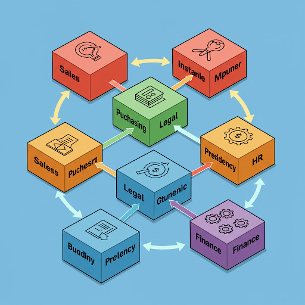
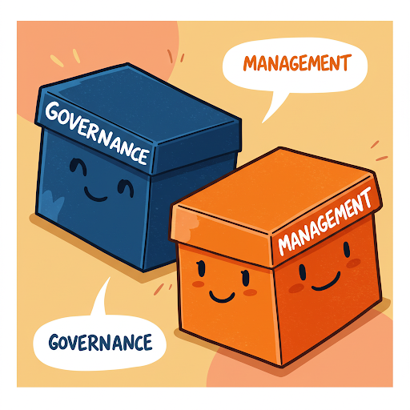
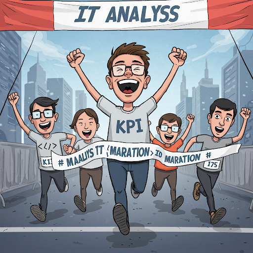

# COBIT - Objetivos de controle para tecnologias de informação e relacionadas

**COBIT** (Control Objectives for Information and Related Technologies) é uma estrutura de **governança** e **gestão** de TIC. Ela foi desenvolvida pela ISACA (Information Systems Audit and Control Association) e é usada para orientar as empresas na implementação de TIC.

O termo "Objetivos de Controle" remete a idéia de "métricas" para qualificar e dimensionar o uso da infraestrutura de TIC disponível. Então de alguma forma vamos ter que mensurar todos os processos como veremos mais adiante.

### Governaça de TIC versus Gestão de TIC

Muito se confunde governança de TIC com gestão de TIC. Vamos ver como o COBIT versão 5 diferencia esses dois termos:

{width="749"}

|  |  |
|-------------------------|-----------------------------------------------|
| {width="187"} | **GOVERNANÇA DE TIC:** Conjunto de **práticas e processos** que asseguram que a **TI apoia eficazmente os objetivos e as estratégias da organização**, gere valor a partir dos investimentos em TI, gerencie os riscos relacionados à TI e otimize a utilização dos recursos e capacidades de TI. |
|  | **GESTÃO DE TIC: uso ponderado de recursos (pessoas, processos, práticas, etc.)** para **atingir determinados objetivos relacionados à tecnologia da informação**, sendo responsável pela execução da orientação definida pelo órgão de governança. A gestão de TI diz respeito ao alinhamento das atividades de planejamento, desenvolvimento, organização e controle operacional com a orientação definida pelo órgão de governança, e à geração de relatórios sobre essas atividades. |

Colocando de forma bem simplista, enquanto a Governança de TIC cria Processos e Políticas de TI alinhadas aos objetivos da empresa, a Gestão de TIC aplica os recursos disponíveis de TIC de forma inteligente.

### Os 5 Princípios do COBIT

O modelo COBIT 5 é baseado em cinco princípios básicos para a governança e gestão de TI da organização. Estes princípios são:

#### 1º Princípio: Atender às Necessidades das Partes Interessadas

{width="320"}

As organizações existem para criar valor para suas Partes interessadas, mantendo o equilíbrio entre a realização de benefícios e a otimização do risco e uso dos recursos. O COBIT 5 fornece todos os processos necessários e demais habilitadores para apoiar a criação de valor para a organização com o uso de TI. Cada organização pode personalizar o COBIT 5 de acordo com seu contexto específico por meio da cascata de objetivos, traduzindo objetivos corporativos de alto nível em objetivos de TI específicos e gerenciáveis, que são então mapeados em práticas e processos específicos.

#### 2º Princípio: Cobrir a Organização de Ponta a Ponta

O COBIT 5 integra a governança corporativa de TI à governança corporativa:

|  |  |
|------------------------|-----------------------------------------------|
| Processos de Negócio x Processos de TIC | Cobre todas as funções e processos corporativos, considerando a tecnologia da informação e tecnologias relacionadas como ativos que devem ser tratados como qualquer outro ativo por todos na organização |
| Alinamento de Gestores e Fornecedores | Considera todos os habilitadores de governança e gestão de TI aplicáveis em toda a organização, de ponta a ponta, incluindo tudo e todos - interna e externamente - que forem considerados relevantes para a governança e gestão das informações e de TI da organização |

#### 3º Princípio: Aplicar Um Modelo Único Integrado

{width="430"}

Existem muitas normas e boas práticas relacionadas a TI, cada qual fornecendo orientações para um conjunto específico de atividades de TI. O COBIT 5 se alinha a outros padrões e modelos importantes em um alto nível e, portanto, pode servir como um modelo unificado para a governança e gestão de TI da organização.

#### 4º Princípio: Permitir uma Abordagem Holística

Uma governança e gestão eficiente e eficaz de TI da organização requer uma abordagem holística, levando em conta seus diversos componentes interligados. O COBIT 5 define um conjunto de sete categorias de habilitadores para apoiar a implementação de um sistema abrangente de gestão e governança de TI da organização.

| Item | Princípios, Políticas e Modelos        |
|------|----------------------------------------|
| 01   | Processos                              |
| 02   | Estruturas Organizacionais             |
| 03   | Cultura, Ética e Comportamento         |
| 04   | Informação                             |
| 05   | Serviços, Infraestrutura e Aplicativos |
| 06   | Pessoas, Habilidades e Competências    |

#### 5º Princípio: Distinguir a Governança da Gestão

{width="285"}

O modelo do COBIT 5 faz uma clara distinção entre governança e gestão. Essas duas disciplinas compreendem diferentes tipos de atividades, exigem modelos organizacionais diferenciados e servem a propósitos diferentes. A governança garante que as necessidades, condições e opções das Partes Interessadas sejam avaliadas a fim de determinar objetivos corporativos acordados e equilibrados; definindo a direção através de priorizações e tomadas de decisão; e monitorando o desempenho e a conformidade com a direção e os objetivos estabelecidos.

## Cobit Aferição de Performance

### KPI - indicadores-chave de desempenho

{width="407"}

**KPI**s (Key Performance Indicator) ou **indicadores-chave de desempenho** são definidos como uma métrica quantificável usada para monitorar o progresso na realização dos objetivos comerciais. Mais especificamente, um KPI fornece informações sobre o desempenho do ativo mais importante de uma organização: **as pessoas**.

Os KPIs são considerados o molho secreto da estratégia empresarial moderna, e todos estão qualificados para utilizá-los. Indicadores-chave de desempenho eficazes permitem que as pessoas tomem decisões precisas e rápidas.

|  |
|------------------------------------------------------------------------|
| KPIs bem projetados podem capacitar as equipes a resolver ineficiências, eliminar solicitações que consomem muito tempo e alinhar tarefas e projetos com metas de toda a empresa. |
| As empresas devem se concentrar nas métricas que têm o maior impacto sobre sua sustentabilidade. Ao focar em projetos, ferramentas e sistemas que realmente fazem a diferença, as empresas constroem um roteiro para maximizar sua velocidade em direção ao crescimento da receita. |
| É crucial identificar as métricas de negócios diretamente relacionadas às metas de negócios. Diferentes áreas terão diferentes KPIs (vendas, produtos, finanças). É importante entender o que cada área quer alcançar e seus critérios de sucesso. Um KPI que não contribui para uma meta de negócios deve ser descartado. |
| Após identificar as métricas, elas devem ser organizadas em indicadores principais (de avanço) e indicadores secundários (de atraso). Os indicadores de avanço mostram se é necessário ajustar a estratégia para alcançar o resultado desejado, enquanto os indicadores de atraso determinam o desempenho dos processos em um período mais longo. |
| Os KPIs devem ser claros e específicos e compreensíveis por toda a empresa. |
| É recomendado colocar os KPIs em uma ferramenta remota para registrar e monitorar o progresso, pois relatórios em formatos tradicionais podem se tornar rapidamente desatualizados e menos acessíveis. O ClickUp é apresentado como uma ferramenta para essa finalidade, oferecendo dashboards personalizáveis. |
| Monitorar KPIs como uma equipe ajuda a definir critérios claros e mensuráveis para o sucesso, permitindo que as equipes trabalhem para atingir metas específicas e medir continuamente seu progresso, o que pode levar a maior envolvimento e motivação. |
| A seleção dos KPIs adequados dependerá do propósito, das metas e dos objetivos da equipe, bem como da análise do desempenho anterior e de fatores externos. |
| Se uma equipe não estiver atingindo as metas de KPI, é importante identificar a causa raiz do problema e garantir que os KPIs sejam alcançáveis, relevantes e realistas. |

### Exemplos de KPIs

#### Performance de Vendas

Indicadores de performance para o departamento de vendas;

| KPI | Descrição |
|:---------------------:|:-----------------------------------------------:|
| Custo de aquisição de clientes | O custo total de aquisição de um cliente (inclui custos gastos no processo de vendas e por meio de esforços de marketing). |
| Atividades de vendas por representante | O número total de tarefas concluídas em um determinado período de tempo. |
| Taxa de conversão de leads em clientes | A porcentagem de leads convertidos em seu processo de vendas. |
| Receita total de vendas | A receita total gerada por seus produtos em um período definido. |

#### Performance de Operações de um setor

Indicadores de performance para uma operação de um departamento ou setor;

| KPI | Descrição |
|:--------------------:|:------------------------------------------------:|
| Duração do ciclo de vendas | O tempo médio que leva entre o contato inicial e o fechamento. |
| Horas extras | O número de horas trabalhadas por um funcionário além de suas horas de trabalho normalmente programadas. |
| Processos desenvolvidos | O número de melhorias feitas nas operações atuais. |
| Custos de inventário | O valor total de todas as despesas relacionadas ao armazenamento de mercadorias não vendidas. |
| Utilização do espaço de escritório | A porcentagem do espaço de escritório usado pelos funcionários. |
| Uso de vantagens da empresa | A porcentagem de vantagens usadas pelos funcionários. |

#### Performance financeira da empresa

Indicadores de performance para setor financeiro da empresa;

| KPI | Descrição |
|:--------------------:|:------------------------------------------------:|
| Retorno sobre o patrimônio líquido | A medida de desempenho financeiro com base no lucro líquido dividido pelo patrimônio líquido. |
| Margem de lucro líquido | A quantidade de dinheiro que sua empresa tem após todas as despesas terem sido deduzidas da receita total. |
| Custo dos produtos vendidos | O custo total de fabricação dos produtos que uma empresa vende (exclui despesas com vendas, administração e marketing). |
| Índice de dívida para patrimônio líquido | A proporção do total de passivos da empresa em relação ao patrimônio líquido. |
| Fluxo de caixa livre | A quantidade de dinheiro restante após as despesas de capital. |

#### Performance de um website

Indicadores de performance para interações em um website;

| KPI | Descrição |
|:-----------------:|:---------------------------------------------------:|
| Proporção de tráfego para MQL | A proporção entre a plataforma de tráfego total gerada e o número de leads qualificados para marketing provenientes desse tráfego. |
| Erros de rastreamento | O número de URLs que são inacessíveis para o Googlebot quando ele examina suas páginas. |
| Taxa de rejeição | O número de pessoas que saíram de seu site em apenas alguns segundos após a chegada. |
| Usabilidade móvel | A velocidade e o desempenho da sua página de destino em telefones e guias. |
| Tráfego de referência | O número de pessoas que visitam seu site a partir de suas mídias sociais. |

#### Performance de inicialização de clientes

Indicadores de performance para início de relacionamento com clientes;

| KPI | Descrição |
|:--------------------:|:------------------------------------------------:|
| Valor da vida útil do cliente | A receita que sua empresa pode esperar de contas de clientes individuais. |
| Taxa de ativação | A porcentagem de usuários que concluem qualquer evento importante no processo de integração. |
| Runway | O número de meses que a empresa pode operar antes de ficar sem dinheiro. |
| Duração média do ciclo de vendas | O número de dias que leva para fechar um negócio, em média. |
| Burn mensal | O montante de dinheiro gasto por mês. |

#### Performance de inicialização de clientes

Indicadores de performance para início de relacionamento com clientes;

| KPI | Descrição |
|:--------------------:|:------------------------------------------------:|
| Valor da vida útil do cliente | A receita que sua empresa pode esperar de contas de clientes individuais. |
| Taxa de ativação | A porcentagem de usuários que concluem qualquer evento importante no processo de integração. |
| Runway | O número de meses que a empresa pode operar antes de ficar sem dinheiro. |
| Duração média do ciclo de vendas | O número de dias que leva para fechar um negócio, em média. |
| Burn mensal | O montante de dinheiro gasto por mês. |

#### Performance de Produtos

Indicadores de performance para Produtos;

| KPI | Descrição |
|:-------------------:|:-------------------------------------------------:|
| Net Promoter Score (NPS) | O número que indica se seus usuários estão prontos para recomendar seu produto a amigos, colegas etc.. |
| Escalonamentos de tíquetes de suporte | O número de tíquetes transferidos para um gerente de suporte ao cliente de nível superior para serem resolvidos. |
| Índice de satisfação do cliente (CSAT) | A taxa de escala da experiência geral de um cliente com o produto, serviço ou funcionário de uma empresa. |
| Velocidade | O número total de testes manuais e automatizados realizados. |
| Daily Active User | O número de usuários ativos por dia. |

## Exercícios de Fixação

### Testes de múltipla escolha

| **TESTE 01** |
|-----------------------------------------------------------------------|
| De acordo com a distinção feita pelo COBIT 5, qual das alternativas abaixo descreve corretamente as responsabilidades principais da Governança de TIC? |
| A) Uso ponderado de recursos (pessoas, processos, práticas, etc.) para atingir determinados objetivos relacionados à tecnologia da informação. |
| B) Alinhamento das atividades de planejamento, desenvolvimento, organização e controle operacional com a orientação definida e a geração de relatórios sobre essas atividades. |
| C) Garantir que as necessidades, condições e opções das Partes Interessadas sejam avaliadas, definindo a direção através de priorizações e tomadas de decisão, e monitorando o desempenho e a conformidade com a direção e os objetivos estabelecidos. |
| D) Execução da orientação definida pelo órgão de governança, aplicando os recursos disponíveis de TIC de forma inteligente. |
| E) Controle operacional dos serviços de TI, sejam internos ou externos, e garantia de que a estratégia de negócios seja suportada de maneira controlada. |

| **TESTE 02** |
|------------------------------------------------------------------------|
| Um dos principais objetivos do COBIT é oferecer um framework abrangente que auxilia as organizações a otimizar o valor gerado pela TI. Conforme as fontes, quais são outros objetivos principais do COBIT? |
| A) Descrever melhores práticas para gerenciamento de serviços de TI, focando na manutenção e operação da Infraestrutura de TI e no gerenciamento de incidentes e problemas,. |
| B) Permitir que a TI seja governada e gerenciada de forma holística para toda a organização e criar uma linguagem comum entre TI e negócios para a governança e gestão de TI corporativa. |
| C) Fornecer gerenciamento da TI com maior controle sobre os Ativos de TI (IC’s) da organização e criar e manter uma Base de Dados do Gerenciamento da Configuração (BDGC). |
| D) Definir critérios claros e mensuráveis para o sucesso, permitindo que as equipes trabalhem para atingir metas específicas enquanto medem continuamente seu progresso. |
| E) Identificar pontos fracos e desencadeadores para criar um desejo de mudança nos níveis de gestão executiva, definindo o escopo da implementação. |

| **TESTE 03** |
|------------------------------------------------------------------------|
| O COBIT 5 é baseado em cinco princípios básicos para a governança e gestão de TI. O Quarto Princípio é "Permitir uma Abordagem Holística",. De acordo com as fontes, o que este princípio envolve? |
| A) Integrar a governança corporativa de TI à governança corporativa, cobrindo todas as funções e processos corporativos, e considerando a TI como ativo a ser tratado por todos na organização. |
| B) Assegurar que as necessidades, condições e opções das Partes Interessadas sejam avaliadas a fim de determinar objetivos corporativos acordados e equilibrados. |
| C) Levar em conta diversos componentes interligados (habilitadores) para uma governança e gestão eficiente e eficaz de TI da organização, definindo sete categorias de habilitadores. |
| D) Alinhar-se a outros padrões e modelos importantes em um alto nível, servindo como um modelo unificado para a governança e gestão de TI da organização. |
| E) Fazer uma clara distinção entre governança e gestão, compreendendo diferentes tipos de atividades, modelos organizacionais diferenciados e propósitos diferentes. |

| **TESTE 04** |
|------------------------------------------------------------------------|
| Conforme descrito nas fontes, qual é um dos propósitos fundamentais dos indicadores-chave de desempenho (KPIs) eficazes? |
| A) Servir como métricas quantitativas para relatórios diários de status de projetos. |
| B) Permitir que as pessoas tomem decisões precisas e rápidas. |
| C) Determinar quão bem os processos e atualizações são realizados em um período de tempo mais curto para ajustes imediatos. |
| D) Substituir a necessidade de um Banco de Dados de Gerenciamento da Configuração (CMDB) para controle de ativos de TI. |
| E) Focar exclusivamente em indicadores de atraso para determinar o desempenho dos processos em um período mais longo. |

### Resposta dos testes de multipla escolha

| Alternativa | Resposta correta |
|:-----------:|:----------------:|
|   **01**    |        C         |
|   **02**    |        B         |
|   **03**    |        C         |
|   **04**    |        B         |
|   **05**    |                  |
|   **06**    |                  |
|   **07**    |                  |
|   **08**    |                  |
|   **09**    |                  |
|   **10**    |                  |
