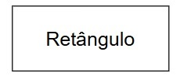
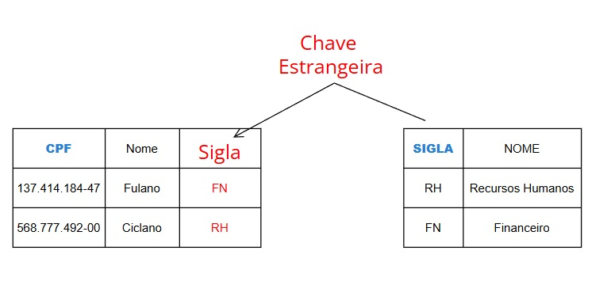
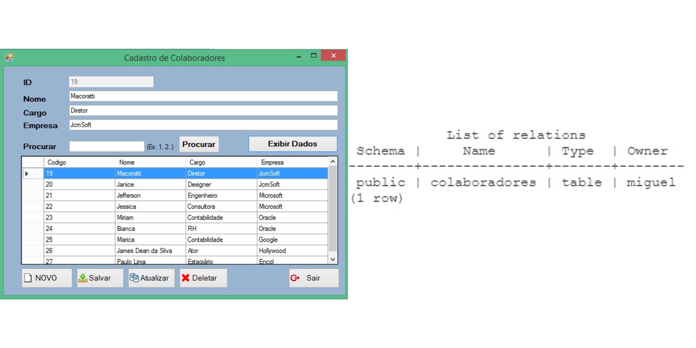
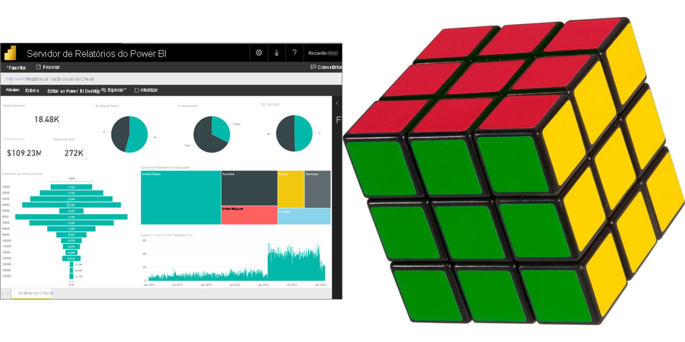
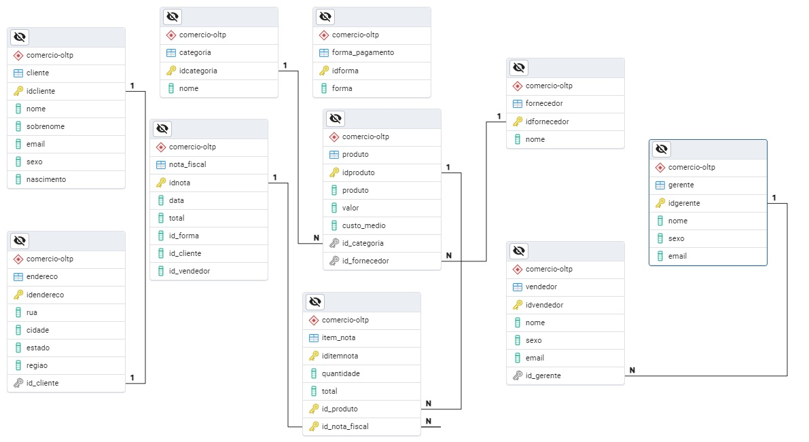
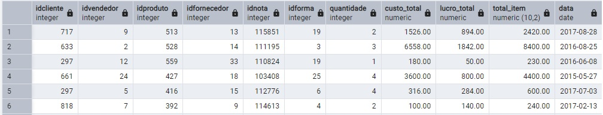
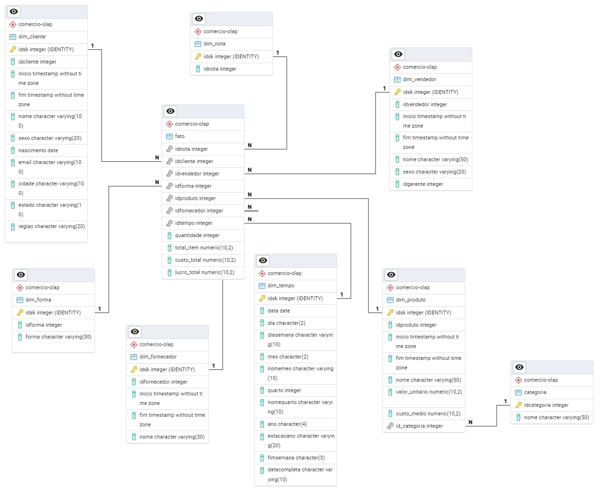
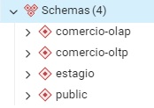

# Tomada de Decisão de Gestão do Conhecimento: Business Inteligence

( Consultar livro LAUDON, Kenneth C.; LAUDON, Jane P. *Sistemas de informação gerenciais*. 11. ed. São Paulo: Pearson Education do Brasil, 2010. p. 180. )

## Introdução: Visitando a teoria de Bancos de Dados

{width="452"}

> **Banco de Dados** é um conjunto de arquivos relacionados entre si com registros sobre algum assunto: pessoas, lugares ou coisas. [[1] - LAUDON, Kenneth C.; LAUDON, Jane P. \*Sistemas de informação gerenciais\*. 11. ed. São Paulo: Pearson Education do Brasil, 2010. p. 180.]


> **Banco de Dados Relacional** é um tipo comum de banco de dados que organiza os dados em tabelas (denominadas entidades) com colunas e linhas [[1] - LAUDON, Kenneth C.; LAUDON, Jane P. \*Sistemas de informação gerenciais\*. 11. ed. São Paulo: Pearson Education do Brasil, 2010. p. 180.]

O Banco de Dados Relacional organiza as informações em **tabelas bidiomensionais** constituídas de **linhas e colunas** chamadas e essas tabelas recebem o nome de **relações**. Cada **relação** possui um **campo-chave** que confere identificação exclusiva a cada registro da tabela.

### Modelo Conceitual "Entidade Relacionamento" de Banco de Dados

O Modelo Entidade-Relacionamento (MER), proposto por Peter Chen em 1976, é uma ferramenta fundamental na modelagem de dados. É um modelo de dados de alto nível que descreve a estrutura conceitual de um banco de dados. O Modelo Entidade-Relacionamento (MER) é representado graficamente através de um DER (Diagrama Entidade-Relacionamento).

É utilizado para projetar Bancos de Dados Relacionais a partir de entrevistas onde se descreve as informações que se deseja armazenar de forma consistente. Exemplo:

"*Desenhe um diagrama entidade-relacionamento DER contendo as entidades funcionarios e departamentos. A entidade "funcionários" possui os atributos "nome" e "CPF". A entidade "Departamentos" possui os atributos "Nome" e "sigla". O atributo "CPF" é chave primária da entidade "Funcionários". O atributo "sigla" é chave primária da entidade "Departamentos". As entidades "Funcionários" e "Departamentos" se relacionam através de um relacionamento chamado "Pertence"*."


Segundo Laudon

> **Diagrama Entidade/Relacionamento (DER)** é uma representação esquemática utilizada para entender as relações entre as tabelas de um banco de dados relacional. [[1] - LAUDON, Kenneth C.; LAUDON, Jane P. \*Sistemas de informação gerenciais\*. 11. ed. São Paulo: Pearson Education do Brasil, 2010. p. 180.]

### Composição e Significado do Diagrama Entidade Relacionamento (DER)

+:------------:+:---------------------------------:+:--------------------------------------:+
| **Nome**     | **Desenho**                       | **Significado**                        |
+--------------+-----------------------------------+----------------------------------------+
| Entidade     |  | Representa uma tabela e é identificada |
|              |                                   |                                        |
|              |                                   | no texto por um **substantivo**.       |
+--------------+-----------------------------------+----------------------------------------+

+:-----------:+:-------------------------------------------:+:--------------------------------------------------------------------:+
| **Nome**    | **Desenho**                                 | **Significado**                                                      |
+-------------+---------------------------------------------+----------------------------------------------------------------------+
| Atributo    | {width="182"} | Representa uma coluna e é identificada no texto por um **adjetivo**. |
+-------------+---------------------------------------------+----------------------------------------------------------------------+

+:--------------:+:--------------------------------------------:+:----------------------------------------------:+
| **Nome**       | **Desenho**                                  | **Significado**                                |
+----------------+----------------------------------------------+------------------------------------------------+
| Relacionamento | {width="185"} | Representa uma **Referência** e é identificada |
|                |                                              |                                                |
|                |                                              | no texto por um **Verbo**.                     |
+----------------+----------------------------------------------+------------------------------------------------+

### Geração do modelo Físico para aplica-lo ao SGBD (Sistema de Gerenciamento de Banco de Dados):

Uma vez que o modelo conceitual seja gerado, o analista pode mapea-lo para um "modelo físico" onde se mapeiam chaves primárias e chaves forasteiras nas tabelas.

Após a geração do modelo físico pode-se gerar o SQL que monta a estrutura do Banco de Dados.



``` sql
-- Exemplo testado e gerado no SGBD Postgres versão 15

-- Tabela Funcionários
CREATE TABLE IF NOT EXISTS "public".funcionarios
(
    cpf bigint NOT NULL,
    nome varchar(200)
);

-- Tabela Departamentos

CREATE TABLE IF NOT EXISTS "public".departamentos
(
    sigla integer NOT NULL,
    nome varchar(200)
);

-- Definindo a coluna "cpf" da tabela "funcionários" como chave primária
alter table "public".funcionarios add constraint "chave_primaria_funcionarios" primary key (cpf);

-- Definindo a coluna "sigla"" da tabela "departamentos" como chave primária
alter table "public".departamentos add constraint "chave_primaria_departamentos" primary key (sigla);

-- Gerando a integridade referêncial 
-- Importando a chave primária da tabela "departamentos" como "chave estrangeira"
-- na tabela "funcionários"

-- primeiro adiciona-se a coluna estrageira "sigla" que é coluna originalmente 
-- pertencente a tabela departamentos
alter table "public".funcionarios add column sigla integer;

-- finalmente conecte a coluna sigla a chave primária da tabela "departamento"
-- criando então uma chave estrageira na tabela "funcionários".
alter table "public".funcionarios add constraint "Chave_estrangeira_Departamento_funcionarios" foreign key (sigla) references "public".departamentos(sigla);
```

## Normalização em Bancos de Dados Relaionais

### Tabela Desnormalizada

Considere a tabela Veículos abaixo:

|  Modelo   | Montadora  |
|:---------:|:----------:|
|  Strada   |    Fiat    |
|   Mobi    |    Fiat    |
|   Pulse   |    Fiat    |
|   Onix    | Chevrolet  |
|  Tracker  | Chevrolet  |
| Onix Plus | Chevrolet  |
|   Polo    | Volkswagen |
|   Nivus   | Volkswagen |
|  T-Cross  | Volkswagen |
|   HB20    |  Hyundai   |
|   Creta   |  Hyundai   |

Separamos o conjunto de elemntos *Montadoras* e *Modelos*.

| MontadoraID | Montadora  |
|:-----------:|:----------:|
|      1      |    Fiat    |
|      2      | Chevrolet  |
|      3      | Volkswagen |
|      4      |  Hyundai   |

| ModeloID |  Modelo   |
|:--------:|:---------:|
|   101    |  Strada   |
|   102    |   Mobi    |
|   103    |   Pulse   |
|   201    |   Onix    |
|   202    |  Tracker  |
|   203    | Onix Plus |
|   301    |   Polo    |
|   302    |   Nivus   |
|   303    |  T-Cross  |
|   401    |   HB20    |
|   402    |   Creta   |

> O processo de fragmentar agrupamentos complexos de dados e simplifica-los a fim de minimizar redundâncias e economizar espaço no Banco de Dados Relacional é chamado de **NORMALIZAÇÃO.** [[1] - LAUDON, Kenneth C.; LAUDON, Jane P. \*Sistemas de informação gerenciais\*. 11. ed. São Paulo: Pearson Education do Brasil, 2010. p. 180.]

Mas Como indicar que cada elemento da tabela "Modelo" está associado a um elemento da tabela "Montadora" ?

### Tabela Normalizada

Considere as tabelas abaixo:

+--------------------+-------------------------------------------+
| MontadoraID        | Montadora                                 |
+:==================:+:=========================================:+
| 1                  | Fiat                                      |
+--------------------+-------------------------------------------+
| 2                  | Chevrolet                                 |
+--------------------+-------------------------------------------+
| 3                  | Volkswagen                                |
+--------------------+-------------------------------------------+
| 4                  | Hyundai                                   |
+--------------------+-------------------------------------------+

| ModeloID |  Modelo   | MontadoraID |
|:--------:|:---------:|:-----------:|
|   101    |  Strada   |      1      |
|   102    |   Mobi    |      1      |
|   103    |   Pulse   |      1      |
|   201    |   Onix    |      2      |
|   202    |  Tracker  |      2      |
|   203    | Onix Plus |      2      |
|   301    |   Polo    |      3      |
|   302    |   Nivus   |      3      |
|   303    |  T-Cross  |      3      |
|   401    |   HB20    |      4      |
|   402    |   Creta   |      4      |

Repare que:

-   É possível identificar que não existem montadoras repetidas na tabela "Montadoras";

-   É possível identificar que não existem modelos repetidos na tabela "Montadoras";

A coluna (atributo) **ModeloID** é a **chave primária** da tabela **Modelos.** A coluna (atributo) **MontadoraID** é a **chave primária** da tabela **Montadoras.**

Na tabela **Modelos**, a coluna **MontadoraID**, acrescentada a tabela Modelos representa a ligação de cada elemento da tabela Modelos e Montadoras. Essa coluna "importada" da tabela Montadoras para a tabela Modelos se chama **chave estrangeira**.

## Regimes de operação de um Banco de Dados Relacional

Os Sistemas de Gerenciamento de Bancos de Dados Relacionais podem operar dentro de dois regimes de uso:

-   OLTP

-   OLAP

### Regime OLTP

O regime de trabalho OLTP é voltado a **transações**, ou seja, os dados estão frequentemente sendo **lidos e escritos** e a **quantidade de dados trafegada é pequena**.

> OLTP ou *Online Transaction Processing* (**Processamento de Transações Online**, em português) serve para designar os sistemas operacionais com dados transacionais. 



### Regime OLAP

O regime de trabalho OLAP é voltado a **análises**, ou seja, os dados estão sendo **lidos esporadicamente** e a **quantidade de dados trafegada a cada leitura é grande**!

> Por outro lado, o OLAP ou Online Analytical Processing (**Processamento Analítico Online**), é uma habilidade para executar dentro do Data Warehouse e realizar análises dos grandes volumes de dados.



## Data Warehouse

Para que um banco de dados relacional opere corretamente em regime de **análise** (OLAP, de onde vem o termo *analytics*), é necessário uma organização de tabelas voltada a esse propósito.

Esse banco de dados organizado voltado a análise é o **Data Warehouse**.

> Data Warehouse (DW) não é simplesmente um repositório de dados, mas sim um sistema complexo cujo principal objetivo é apoiar a tomada de decisão gerencial - Ralph Kimball - Datawarehouse Toolkit (2013)

## Por que construir um Data Warehouse ?

Frequentemente em um banco de dados relacional **operando em regime transacional** (OLTP), as tabelas são normalizadas.

O Banco de Dados Transacional abaixo possui as seguintes tabelas:

| CADASTROS            |
|----------------------|
| Produtos             |
| Fornecedores         |
| Categorias           |
| Notas Fiscais        |
| Endereço de Clientes |
| Clientes             |
| Formas de Pagamentos |
| vendedores           |



Verifique se os dados das tabelas abaixo conseguem resolver o caso do cliente abaixo:

*Hoje vendemos muito, temos lucro, mas não sei qual categoria, fornecedor ou produto me dá mais lucro. Não estou interessado em quantidade. Preciso de analises sumarizadas. Hoje não me interessa saber quantas vendas tem um vendedor e sim o total vendido, pois os mesmos podem recomendar produtos para os nossos clientes. Também gostaria de sabe meus custos por sazonalidade. Preciso saber em que época do ano gasto mais para controlar meus investimentos em estoque ou contratações. Saber qual cliente compra mais comigo em termos totais também seria uma boa ideia. Outra necessidade é um relatório com os dados dos meus clientes, pois a enviar mala direta vai ser uma prática da empresa. Não estou seguro se uma análise por categoria ou fornecedor seria útil. A sua equipe também pode disponibilizar o que achar relevante para o negócio.*

-   Quem são os melhores clientes?

-   Quem são os melhores vendedores?

-   Qual categoria rende mais?

-   Qual a minha relação com os fornecedores?

-   Qual meu pior e melhor produto?

-   Em qual região eu vendo mais?

### RESOLVENDO ANTES DE USAR BI: RELATÓRIOS:

Se pensarmos na teoria dos conjuntos temos 7 deles: Produtos, Fornecedores, Categorias, Notas Fiscais, Endereço de Clientes, Clientes, Formas de Pagamentos, vendedores.

Podemos pensar em um relatório de Vendas como sendo uma espécie produtos carteziano entre os conjuntos

( **nota_fiscal** x **item_nota** x **cliente** x **vendedor** x **produto** x **forma_pagamento** x **fornecedor** )

desde que os elementos de cada conjunto fossem todos "pareados" entre sí.

O resultado seria:

{width="681" height="222"}

Quem é o melhor Cliente ? **Cliente 633**

Quem é o melhor Vendedor ? Empate entre o **vendedor** **24** e o **vendedor** **5**

Qual categoria vende mais ? Produto da **categoria 427 e categoria 416**

O problema: Gerar Relatórios consome recursos de memória e processamento no Banco.

A solução: Criar um banco separado com os relatórios feitos: o **Data WareHouse**.

## Anatomia de um Data Warehouse: o modelo Estrela (STAR)

Um Banco de dados em disposição Data Warehouse é composto por dois tipos de tabelas principais que vão gerar os relatórios:

TABELA FATO;

TABELAS DE DIMENSÕES:

### Tabela Fato

A tabela fato é o coração do Modelo de banco de Dados Data WareHouse. Segundo Ralph Kimball

> **A tabela fato armazena Métricas/Fatos, ou seja** armazena os dados quantitativos e numéricos que se deseja analisar. Estes são os *"fatos" do processo de negócio*, como `Valor_Venda`, `Quantidade_Itens`, `Custo_Produto`, `Numero_Chamadas`, `Duracao_Sessao.`

A tabela Fato possui um conjunto de colunas que são **chaves estrangeiras (foreign keys)**. Cada uma dessas chaves aponta para a chave primária de uma das tabelas de dimensão associadas. É através dessas chaves que a tabela fato se conecta às tabelas de dimensão que fornecem o contexto descritivo para os fatos.

### Tabelas Dimensões

As tabelas Dimensões são as fiéis companheiras de uma Tabela Fato no modelo de banco de Dados Data WareHouse. Segundo Ralph Kimball

**As tabelas Dimensões contém atributos descritivos, ou seja** armazena os atributos textuais e categóricos que descrevem os aspectos do negócio. São eles que respondem às perguntas "quem, o quê, onde, quando, como, por quê" sobre os fatos. Exemplos incluem `Nome_Cliente`, `Cidade_Cliente`, `Nome_Produto`, `Categoria_Produto`, `Marca`, `Nome_Loja`, `Data_Completa`, `Dia_Semana`, `Mes`, `Ano`, etc.

Considere o **Data WareHouse** abaixo:

| Tabela Fato: | Tabelas de Dimensões: |
|----|----|
| fato | dim_cliente, dim_forma, dim_fornecedor, dim_nota, dim_produto, dim_tempo, dim_vendedor |



## Quais as etapas para construir um Data WareHouse

### 1 - Modelar um SGBD o mais desnormalizado possível

As tabelas do Bando de dados Relacional devem estar o mais normalizadas possível para que se possa gerar relatórios com SQL.

### 2 - Criar um Banco de dados ou esquema de Estágio

A Área de Estágio deve ser uma cópia das tabelas Fatos e Dimensões do **Data WareHouse** **sem regras de integridade**;

O processo de se Transferir dados das tabelas **OLTP** para **Área de Estágio** e, em seguida, para o **Data WareHouse** é chamado de **ETL** ( Extração, Transformação e Carga);

### 3 - Modelar um Data WareHouse criando sua tabela Fato e suas Tabelas Dimensões

A **tabela Fato** deve ser modelada enquadrando os eventos em janelas de tempo (meses, semanas, dias, anos); Exempo: **Vendas x Dia , Vendas x Semana, Vendas x Mês , Vendas x Ano.**

As **tabelas de Dimensões** são praticamente cópias das tabelas de cadastros; Podem ter algum grau de Desnormalização (ex Tabela Cliente e Tabela endereço podem ser fundidas em uma tabela única denominada dim_Clientes);

{width="350"}

Nota: Verificar scripts SQL na pasta "**exercicios**\\**BusinessInteligence\\01**"

## Cubos

São porções das tabelas do Data WareHouse que são carregadas em memória.

{width="196"}

+----------------+------------------------------------------+---------------------------------------------+
| Característica | Data Warehouse (DW)                      | Cubo                                        |
+:==============:+:========================================:+:===========================================:+
| Função         | Repositório central, integração, storage | Estrutura otimizada para consulta e análise |
+----------------+------------------------------------------+---------------------------------------------+
| Escopo         | Amplo, dados de toda a empresa           | Focado em processos/áreas específicas       |
+----------------+------------------------------------------+---------------------------------------------+
| Estrutura      | Relacional (Star/Snowflake Schema)       | Multidimensional                            |
+----------------+------------------------------------------+---------------------------------------------+
| Dados          | Detalhados e históricos, integrados      | Agregados, sumarizados, derivados do DW     |
+----------------+------------------------------------------+---------------------------------------------+
| Otimização     | Armazenamento, integração, consistência  | Velocidade de consulta, análise interativa  |
+----------------+------------------------------------------+---------------------------------------------+
| Relação        | É a fonte de dados para o Cubo           | É construído sobre (ou a partir) do DW      |
+----------------+------------------------------------------+---------------------------------------------+

## Referências:

**[1] - LAUDON, Kenneth C.; LAUDON, Jane P. \*Sistemas de informação gerenciais\*. 11. ed. São Paulo: Pearson Education do Brasil, 2010. p. 180.**

**[2] - KIMBALL, Ralph; ROSS, Margy. The Data Warehouse Toolkit: The Definitive Guide to Dimensional Modeling. 3. ed. Hoboken, NJ: John Wiley & Sons, 2013.**
